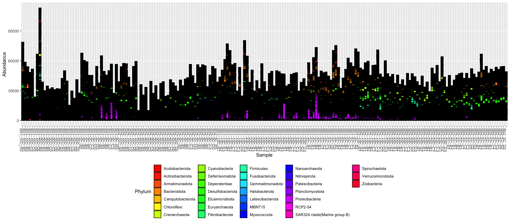

# Reading in the experiment data and exploring the Phyloseq object

The phyloseq package has become a convenient way a managing micobial community data, filtering and visualizing data, performing analysis such as ordination. Along with the standard R environment and packages vegan and vegetarian you can perform virtually any analysis. Today we will

1. Load phyloseq object
2. Perform some QA/QC
3. Filter Data
5. Graphical Summaries
6. Ordination
7. Differential Abundances

## Load our libraries


```r
# Set up global options for nice reports and keeping figures:
knitr::opts_chunk$set(fig.width=14, fig.height=8, fig.align="center",
                      warning=FALSE, message=FALSE)
```

Lets start by loading libraries


```r
library(phyloseq)
library(phangorn)
library(ggplot2)

nice_colors = c("#999999", "#E69F00", "#56B4E9","#e98756","#c08160","#5800e6", "#CDDC49", "#C475D3", 
                "#E94B30", "#233F57", "#FEE659", "#A1CFDD", "#F4755E", "#D6F6F7","#EB6D58", "#6898BF")
```

## Read in the dataset, 

Lets first read in the Phyloseq object, this is the full dataset 197 generated from the same pipeline used in the data reduction section.


```r
load(file="phyloseq_nochim_silva.RData")
ls()
```

```
## [1] "nice_colors"     "ps.silva.nochim"
```

```r
# set the data set used for analysis
ps = ps.silva.nochim

head(otu_table(ps))[,1:10]
```

```
## OTU Table:          [10 taxa and 6 samples]
##                      taxa are columns
##            ASV1 ASV2 ASV3 ASV4 ASV5 ASV6 ASV7 ASV8 ASV9 ASV10
## Bs1_10C_A0 2041   46  944  234  506  119  381   84  150  1140
## Bs1_10C_A5  965   45  961  163  609  304  165  110  256   576
## Bs1_10C_B0 1151   10  731  184  387   73  192   58   90   429
## Bs1_10C_B5  525   21  586  155  361  143  129   39  149   550
## Bs1_10C_C0 1218   10  560  165  320   85  327   52  115   472
## Bs1_10C_C5  352   15  294   61  213  108   68   39   95   242
```

```r
head(sample_data(ps))
```

```
##              SampleID Group Temp Replicate
## Bs1_10C_A0 Bs1_10C_A0   Bs1  10C        A0
## Bs1_10C_A5 Bs1_10C_A5   Bs1  10C        A5
## Bs1_10C_B0 Bs1_10C_B0   Bs1  10C        B0
## Bs1_10C_B5 Bs1_10C_B5   Bs1  10C        B5
## Bs1_10C_C0 Bs1_10C_C0   Bs1  10C        C0
## Bs1_10C_C5 Bs1_10C_C5   Bs1  10C        C5
```

```r
head(tax_table(ps))
```

```
## Taxonomy Table:     [6 taxa by 7 taxonomic ranks]:
##      Kingdom    Phylum             Class               Order                
## ASV1 "Bacteria" "Desulfobacterota" "Syntrophobacteria" "Syntrophobacterales"
## ASV2 "Bacteria" "Cyanobacteria"    "Cyanobacteriia"    "Chloroplast"        
## ASV3 "Bacteria" "Firmicutes"       "Bacilli"           "Bacillales"         
## ASV4 "Bacteria" "Myxococcota"      "bacteriap25"       NA                   
## ASV5 "Bacteria" "Firmicutes"       "Bacilli"           "Bacillales"         
## ASV6 "Bacteria" "Firmicutes"       "Clostridia"        "Clostridiales"      
##      Family                 Genus                         Species
## ASV1 "Syntrophobacteraceae" "Syntrophobacter"             NA     
## ASV2 NA                     NA                            NA     
## ASV3 "Planococcaceae"       "Paenisporosarcina"           NA     
## ASV4 NA                     NA                            NA     
## ASV5 "Planococcaceae"       "Paenisporosarcina"           NA     
## ASV6 "Clostridiaceae"       "Clostridium sensu stricto 1" NA
```

```r
head(refseq(ps))
```

```
## DNAStringSet object of length 6:
##     width seq                                               names               
## [1]   255 TACGGAGGGTGCGAGCGTTATTC...CGAAAGCGTGGGGAGCAAACAGG ASV1
## [2]   253 GACGGAGGATGCAAGTGTTATCC...CGAAAGCTAGGGTAGCAAATGGG ASV2
## [3]   253 TACGTAGGTGGCAAGCGTTGTCC...CGAAAGCGTGGGGAGCAAACAGG ASV3
## [4]   253 TACAGAGGGTGCAAGCGTTGTTC...CGAAAGCGTGGGGAGCAAACAGG ASV4
## [5]   253 TACGTAGGTGGCAAGCGTTGTCC...CGAAAGCGTGGGGAGCAAACAGG ASV5
## [6]   253 TACGTAGGTGGCAAGCGTTGTCC...CGAAAGCGTGGGGAGCAAACAGG ASV6
```

```r
head(rank_names(ps))
```

```
## [1] "Kingdom" "Phylum"  "Class"   "Order"   "Family"  "Genus"
```

```r
sample_variables(ps)
```

```
## [1] "SampleID"  "Group"     "Temp"      "Replicate"
```

### Root the phylogenetic tree

Some analysis require the phylogenetic tree to be rooted. We use phanghorn root command to set our root.


```r
set.seed(1)
is.rooted(phy_tree(ps))
```

```
## [1] FALSE
```

```r
phy_tree(ps) <- root(phy_tree(ps), sample(taxa_names(ps), 1), resolve.root = TRUE)
is.rooted(phy_tree(ps))
```

```
## [1] TRUE
```

### The Phyloseq Object

A lot of information is in this object, spend somem time to get to know it.

* *Explore the sample data, how many Groups do we have? Temps? patterns of replicate?*
* *Using the `@` operator to access class objects are there any other info in the ps object not already looked at/*
* * Use `?"phyloseq-class"` to get information on the class and object.


```r
ps
```

```
## phyloseq-class experiment-level object
## otu_table()   OTU Table:         [ 1500 taxa and 197 samples ]
## sample_data() Sample Data:       [ 197 samples by 4 sample variables ]
## tax_table()   Taxonomy Table:    [ 1500 taxa by 7 taxonomic ranks ]
## phy_tree()    Phylogenetic Tree: [ 1500 tips and 1499 internal nodes ]
## refseq()      DNAStringSet:      [ 1500 reference sequences ]
```

## Drawing our first plot

```r
ps
```

```
## phyloseq-class experiment-level object
## otu_table()   OTU Table:         [ 1500 taxa and 197 samples ]
## sample_data() Sample Data:       [ 197 samples by 4 sample variables ]
## tax_table()   Taxonomy Table:    [ 1500 taxa by 7 taxonomic ranks ]
## phy_tree()    Phylogenetic Tree: [ 1500 tips and 1499 internal nodes ]
## refseq()      DNAStringSet:      [ 1500 reference sequences ]
```

```r
plot_bar(ps, fill = "Phylum") + theme(legend.position="bottom" ) +  scale_fill_manual(values = rainbow(length(unique(tax_table(ps)[,"Phylum"]))))
```




# Cleanup

Save object


```r
dir.create("rdata_objects", showWarnings = FALSE)
save(ps, file=file.path("rdata_objects", "initial_rooted.Rdata"))
```

Get next Rmd


```r
download.file("https://raw.githubusercontent.com/ucdavis-bioinformatics-training/2021-May-Microbial-Community-Analysis/master/data_analysis/mca-part2.Rmd", "mca-part2.Rmd")
```

Record session information

```r
sessionInfo()
```

```
## R version 4.0.3 (2020-10-10)
## Platform: x86_64-apple-darwin17.0 (64-bit)
## Running under: macOS Big Sur 10.16
## 
## Matrix products: default
## BLAS:   /Library/Frameworks/R.framework/Versions/4.0/Resources/lib/libRblas.dylib
## LAPACK: /Library/Frameworks/R.framework/Versions/4.0/Resources/lib/libRlapack.dylib
## 
## locale:
## [1] en_US.UTF-8/en_US.UTF-8/en_US.UTF-8/C/en_US.UTF-8/en_US.UTF-8
## 
## attached base packages:
## [1] stats     graphics  grDevices utils     datasets  methods   base     
## 
## other attached packages:
## [1] ggplot2_3.3.3   phangorn_2.7.0  ape_5.5         phyloseq_1.34.0
## 
## loaded via a namespace (and not attached):
##  [1] Rcpp_1.0.6          lattice_0.20-44     prettyunits_1.1.1  
##  [4] Biostrings_2.58.0   assertthat_0.2.1    digest_0.6.27      
##  [7] foreach_1.5.1       utf8_1.2.1          R6_2.5.0           
## [10] plyr_1.8.6          stats4_4.0.3        evaluate_0.14      
## [13] highr_0.9           pillar_1.6.1        zlibbioc_1.36.0    
## [16] rlang_0.4.11        progress_1.2.2      data.table_1.14.0  
## [19] vegan_2.5-7         jquerylib_0.1.4     S4Vectors_0.28.1   
## [22] Matrix_1.3-3        rmarkdown_2.8       labeling_0.4.2     
## [25] splines_4.0.3       stringr_1.4.0       igraph_1.2.6       
## [28] munsell_0.5.0       compiler_4.0.3      xfun_0.23          
## [31] pkgconfig_2.0.3     BiocGenerics_0.36.1 multtest_2.46.0    
## [34] mgcv_1.8-35         htmltools_0.5.1.1   biomformat_1.18.0  
## [37] tidyselect_1.1.1    tibble_3.1.2        quadprog_1.5-8     
## [40] IRanges_2.24.1      codetools_0.2-18    permute_0.9-5      
## [43] fansi_0.4.2         withr_2.4.2         crayon_1.4.1       
## [46] dplyr_1.0.6         MASS_7.3-54         rhdf5filters_1.2.1 
## [49] grid_4.0.3          nlme_3.1-152        jsonlite_1.7.2     
## [52] gtable_0.3.0        lifecycle_1.0.0     DBI_1.1.1          
## [55] magrittr_2.0.1      scales_1.1.1        stringi_1.6.2      
## [58] farver_2.1.0        XVector_0.30.0      reshape2_1.4.4     
## [61] bslib_0.2.5.1       ellipsis_0.3.2      vctrs_0.3.8        
## [64] generics_0.1.0      fastmatch_1.1-0     Rhdf5lib_1.12.1    
## [67] iterators_1.0.13    tools_4.0.3         ade4_1.7-16        
## [70] Biobase_2.50.0      glue_1.4.2          purrr_0.3.4        
## [73] hms_1.1.0           parallel_4.0.3      survival_3.2-11    
## [76] yaml_2.2.1          colorspace_2.0-1    rhdf5_2.34.0       
## [79] cluster_2.1.2       knitr_1.33          sass_0.4.0
```
