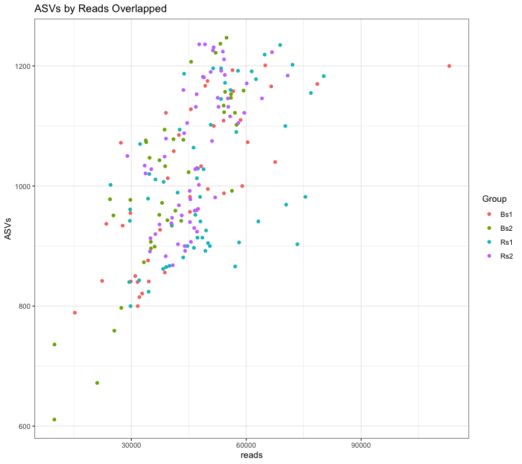

# Quality checks in our data

## Load our libraries


```r
# Set up global options for nice reports and keeping figures:
knitr::opts_chunk$set(fig.width=14, fig.height=8, fig.align="center",
                      warning=FALSE, message=FALSE)
```

Lets start by loading libraries


```r
library(phyloseq)
library(vegan)
library(ggplot2)
library(kableExtra)
library(tidyr)

nice_colors = c("#999999", "#E69F00", "#56B4E9","#e98756","#c08160","#5800e6", "#CDDC49", "#C475D3", 
                "#E94B30", "#233F57", "#FEE659", "#A1CFDD", "#F4755E", "#D6F6F7","#EB6D58", "#6898BF")
```

## Load prior results


```r
load(file=file.path("rdata_objects", "initial_rooted.Rdata"))
```

## Exploring reads, ASVs per sample

Reads per sample, all samples
 

```r
df = data.frame(ASVs=rowSums(otu_table(ps)>0), reads=sample_sums(ps), sample_data(ps))

ggplot(df, aes(x=reads)) + geom_histogram(bins=50, color='black', fill='grey') + 
  theme_bw() +  geom_vline(xintercept=10000, color= "red", linetype='dashed') +
  labs(title="Histogram: Reads per Sample") + xlab("Read Count") + ylab("Sample Count")
```


Scatter Plot, ASVs vs reads

```r
ggplot(df, aes(x = Group, y = reads, color = ASVs)) +
  geom_boxplot(color="black") + theme_bw() +
  geom_jitter(width=.2, height=0)  + 
  theme(axis.text.x = element_text(angle = 90)) +
  geom_hline(yintercept=10000, color= "purple", linetype='dashed') +
  geom_hline(yintercept=1000, color= "red", linetype='dashed') +
  ggtitle("Reads sequenced by SampleGroup")
```


### Rarefaction curve plots

Rarefaction curves show the number of [Amplicon Sequence Variants ](https://www.nature.com/articles/ismej2017119) detected as a function of sequencing depth. Optimally the curve will flatten out, indicating that most of the diversity in the population has been sampled. Depending on the type of experiment, it may not be necessary to fully sample the community in order to obtain useful information about the major changes or trends, especially for common community members.


```r
out = rarecurve(otu_table(ps), col=nice_colors, step=100 , lwd=2, ylab="ASVs", label=F,
              main="Rarefaction Curve for all samples")
```


A ggplot rarefacion curve, borrowed form [here](http://r-sig-ecology.471788.n2.nabble.com/Rarefaction-curves-in-ggplot-td7580273.html)


```r
# We use the rarefaction curve data produce by vegan above
names(out) = rownames(otu_table(ps))

# Coerce data into "long" form.
protox <- mapply(FUN = function(x, y) {
  mydf <- as.data.frame(x)
  colnames(mydf) <- "value"
  mydf$SampleID <- y
  mydf$subsample <- attr(x, "Subsample")
  mydf
}, x = out, y = as.list(names(out)), SIMPLIFY = FALSE)

xy <- do.call(rbind, protox)
rownames(xy) <- NULL  # pretty
xy = data.frame(xy, 
  sample_data(ps)[match(xy$SampleID, rownames(sample_data(ps))), ])
# Plot Rarefaction curve
ggplot(xy, aes(x = subsample, y = value, color = SampleID)) +
  theme_bw() + 
  scale_color_discrete(guide = FALSE) +  # turn legend on or off
  geom_line() +
  geom_vline(xintercept=10000, color= "red", linetype='dashed') + 
  labs(title="Rarefaction curves") + xlab("Sequenced Reads") + ylab('ASVs Detected')
```


```r
# Plot Rarefaction curve
ggplot(xy, aes(x = subsample, y = value, color = SampleID)) +
  theme_bw() + 
  scale_color_discrete(guide = FALSE) +  # turn legend on or off
  geom_line() +
  facet_wrap(~Group) + 
  geom_vline(xintercept=10000, color= "red", linetype='dashed') + 
  labs(title="Rarefaction curves by Group") + xlab("Sequenced Reads") + ylab('ASVs Detected')
```


```r
# Plot Rarefaction curve, faceting by group
ggplot(xy, aes(x = subsample, y = value, color = SampleID)) +
  theme_bw() + 
  scale_color_discrete(guide = FALSE) +  # turn legend on or off
  geom_line() +
  facet_wrap(~Group) + 
  geom_vline(xintercept=10000, color= "red", linetype='dashed') + 
  labs(title="Rarefaction curves by Group") + xlab("Sequenced Reads") + ylab('ASVs Detected')
```


The rarefaction curves suggest that there is a range of ~800-1200 ASV per sample in the study. Each group is also pretty similar


* *Try faceting by the Temperature, do you see a different trend?*

### Exploring the relationship between ASV and read count.


Scatter plot of ASVs by Reads colored by Group indicates that all samples mix well and are fairly well sampled.

* *What about coloring by the other factors, Temp and Replicate? Do any new patterns emerge?*

## Taxonomic Assignment QA/QC

Plotting the amplicon length distribution


```r
df = data.frame(names=names(refseq(ps)), ASV.Length = Biostrings::width(refseq(ps)))
ggplot(df, aes(x=ASV.Length)) + geom_histogram(binwidth=1, color='black', fill='grey') + 
  theme_bw() + labs(title="Histogram: Amplicon Lengths")
```


Are there trends in the fraction of **reads** that can be assigned to taxonomic level by experimental variables?


```r
readsPerSample = rowSums(otu_table(ps))
fractionReadsAssigned = sapply(colnames(tax_table(ps)), function(x){
  rowSums(otu_table(ps)[, !is.na(tax_table(ps))[,x]]) / readsPerSample
})

fractionReadsAssigned = data.frame(SampleID = rownames(fractionReadsAssigned), fractionReadsAssigned)
fractionReadsAssigned.L = pivot_longer(fractionReadsAssigned, 
    cols=colnames(tax_table(ps)), names_to="taxlevel", values_to="fractionReadsAssigned")
fractionReadsAssigned.L = data.frame(fractionReadsAssigned.L, sample_data(ps)[fractionReadsAssigned.L$SampleID,])

fractionReadsAssigned.L$taxlevelf = factor(fractionReadsAssigned.L$taxlevel, levels=c("Kingdom","Phylum","Class","Order","Family","Genus","Species"))

# Boxplot, fraction assigned by SampleType
ggplot(fractionReadsAssigned.L, aes(y = fractionReadsAssigned, x = taxlevelf, fill=Group, color=Replicate)) +
  theme_bw() +
  geom_boxplot(color='black', outlier.shape=NA) +  
  ggtitle("Fraction of reads identified by taxonomic level") +
  geom_point(position=position_jitterdodge(jitter.width=0, jitter.height=0), size=.5)
```


Are there trends in the fraction of **ASVs** that can be assigned to taxonomic level by experimental variables?


Genus level:

The statistics in this plot are calculated by merging taxa at the "Genus" rank with the tax_glom() function. This strategy works by summing reads from all ASVs with the same assignment at the specified taxonomic level. The ASV with the highest read count is selected as the representative for the agglomerated set. ASV with NA are removed.


Top 20 most **abundant** ASVs and their taxonomic assignment:

<table class="table table-striped" style="width: auto !important; margin-left: auto; margin-right: auto;">
 <thead>
  <tr>
   <th style="text-align:left;-webkit-transform: rotate(0deg); -moz-transform: rotate(0deg); -ms-transform: rotate(0deg); -o-transform: rotate(0deg); transform: rotate(0deg);">   </th>
   <th style="text-align:right;-webkit-transform: rotate(0deg); -moz-transform: rotate(0deg); -ms-transform: rotate(0deg); -o-transform: rotate(0deg); transform: rotate(0deg);"> Prevalence </th>
   <th style="text-align:right;-webkit-transform: rotate(0deg); -moz-transform: rotate(0deg); -ms-transform: rotate(0deg); -o-transform: rotate(0deg); transform: rotate(0deg);"> TotalAbundance </th>
   <th style="text-align:left;-webkit-transform: rotate(0deg); -moz-transform: rotate(0deg); -ms-transform: rotate(0deg); -o-transform: rotate(0deg); transform: rotate(0deg);"> Kingdom </th>
   <th style="text-align:left;-webkit-transform: rotate(0deg); -moz-transform: rotate(0deg); -ms-transform: rotate(0deg); -o-transform: rotate(0deg); transform: rotate(0deg);"> Phylum </th>
   <th style="text-align:left;-webkit-transform: rotate(0deg); -moz-transform: rotate(0deg); -ms-transform: rotate(0deg); -o-transform: rotate(0deg); transform: rotate(0deg);"> Class </th>
   <th style="text-align:left;-webkit-transform: rotate(0deg); -moz-transform: rotate(0deg); -ms-transform: rotate(0deg); -o-transform: rotate(0deg); transform: rotate(0deg);"> Order </th>
   <th style="text-align:left;-webkit-transform: rotate(0deg); -moz-transform: rotate(0deg); -ms-transform: rotate(0deg); -o-transform: rotate(0deg); transform: rotate(0deg);"> Family </th>
   <th style="text-align:left;-webkit-transform: rotate(0deg); -moz-transform: rotate(0deg); -ms-transform: rotate(0deg); -o-transform: rotate(0deg); transform: rotate(0deg);"> Genus </th>
   <th style="text-align:left;-webkit-transform: rotate(0deg); -moz-transform: rotate(0deg); -ms-transform: rotate(0deg); -o-transform: rotate(0deg); transform: rotate(0deg);"> Species </th>
  </tr>
 </thead>
<tbody>
  <tr>
   <td style="text-align:left;"> ASV1 </td>
   <td style="text-align:right;"> 197 </td>
   <td style="text-align:right;"> 170379 </td>
   <td style="text-align:left;"> Bacteria </td>
   <td style="text-align:left;"> Desulfobacterota </td>
   <td style="text-align:left;"> Syntrophobacteria </td>
   <td style="text-align:left;"> Syntrophobacterales </td>
   <td style="text-align:left;"> Syntrophobacteraceae </td>
   <td style="text-align:left;"> Syntrophobacter </td>
   <td style="text-align:left;"> NA </td>
  </tr>
  <tr>
   <td style="text-align:left;"> ASV2 </td>
   <td style="text-align:right;"> 185 </td>
   <td style="text-align:right;"> 88391 </td>
   <td style="text-align:left;"> Bacteria </td>
   <td style="text-align:left;"> Cyanobacteria </td>
   <td style="text-align:left;"> Cyanobacteriia </td>
   <td style="text-align:left;"> Chloroplast </td>
   <td style="text-align:left;"> NA </td>
   <td style="text-align:left;"> NA </td>
   <td style="text-align:left;"> NA </td>
  </tr>
  <tr>
   <td style="text-align:left;"> ASV3 </td>
   <td style="text-align:right;"> 197 </td>
   <td style="text-align:right;"> 88231 </td>
   <td style="text-align:left;"> Bacteria </td>
   <td style="text-align:left;"> Firmicutes </td>
   <td style="text-align:left;"> Bacilli </td>
   <td style="text-align:left;"> Bacillales </td>
   <td style="text-align:left;"> Planococcaceae </td>
   <td style="text-align:left;"> Paenisporosarcina </td>
   <td style="text-align:left;"> NA </td>
  </tr>
  <tr>
   <td style="text-align:left;"> ASV4 </td>
   <td style="text-align:right;"> 197 </td>
   <td style="text-align:right;"> 51311 </td>
   <td style="text-align:left;"> Bacteria </td>
   <td style="text-align:left;"> Myxococcota </td>
   <td style="text-align:left;"> bacteriap25 </td>
   <td style="text-align:left;"> NA </td>
   <td style="text-align:left;"> NA </td>
   <td style="text-align:left;"> NA </td>
   <td style="text-align:left;"> NA </td>
  </tr>
  <tr>
   <td style="text-align:left;"> ASV5 </td>
   <td style="text-align:right;"> 195 </td>
   <td style="text-align:right;"> 47771 </td>
   <td style="text-align:left;"> Bacteria </td>
   <td style="text-align:left;"> Firmicutes </td>
   <td style="text-align:left;"> Bacilli </td>
   <td style="text-align:left;"> Bacillales </td>
   <td style="text-align:left;"> Planococcaceae </td>
   <td style="text-align:left;"> Paenisporosarcina </td>
   <td style="text-align:left;"> NA </td>
  </tr>
  <tr>
   <td style="text-align:left;"> ASV6 </td>
   <td style="text-align:right;"> 197 </td>
   <td style="text-align:right;"> 46828 </td>
   <td style="text-align:left;"> Bacteria </td>
   <td style="text-align:left;"> Firmicutes </td>
   <td style="text-align:left;"> Clostridia </td>
   <td style="text-align:left;"> Clostridiales </td>
   <td style="text-align:left;"> Clostridiaceae </td>
   <td style="text-align:left;"> Clostridium sensu stricto 1 </td>
   <td style="text-align:left;"> NA </td>
  </tr>
  <tr>
   <td style="text-align:left;"> ASV7 </td>
   <td style="text-align:right;"> 179 </td>
   <td style="text-align:right;"> 44661 </td>
   <td style="text-align:left;"> Bacteria </td>
   <td style="text-align:left;"> Bacteroidota </td>
   <td style="text-align:left;"> Bacteroidia </td>
   <td style="text-align:left;"> Chitinophagales </td>
   <td style="text-align:left;"> Chitinophagaceae </td>
   <td style="text-align:left;"> Flavisolibacter </td>
   <td style="text-align:left;"> NA </td>
  </tr>
  <tr>
   <td style="text-align:left;"> ASV8 </td>
   <td style="text-align:right;"> 148 </td>
   <td style="text-align:right;"> 43180 </td>
   <td style="text-align:left;"> Bacteria </td>
   <td style="text-align:left;"> Proteobacteria </td>
   <td style="text-align:left;"> Alphaproteobacteria </td>
   <td style="text-align:left;"> Rickettsiales </td>
   <td style="text-align:left;"> Mitochondria </td>
   <td style="text-align:left;"> NA </td>
   <td style="text-align:left;"> NA </td>
  </tr>
  <tr>
   <td style="text-align:left;"> ASV9 </td>
   <td style="text-align:right;"> 196 </td>
   <td style="text-align:right;"> 42622 </td>
   <td style="text-align:left;"> Bacteria </td>
   <td style="text-align:left;"> Firmicutes </td>
   <td style="text-align:left;"> Bacilli </td>
   <td style="text-align:left;"> Bacillales </td>
   <td style="text-align:left;"> Bacillaceae </td>
   <td style="text-align:left;"> Bacillus </td>
   <td style="text-align:left;"> NA </td>
  </tr>
  <tr>
   <td style="text-align:left;"> ASV10 </td>
   <td style="text-align:right;"> 196 </td>
   <td style="text-align:right;"> 41505 </td>
   <td style="text-align:left;"> Bacteria </td>
   <td style="text-align:left;"> Bacteroidota </td>
   <td style="text-align:left;"> Ignavibacteria </td>
   <td style="text-align:left;"> Ignavibacteriales </td>
   <td style="text-align:left;"> Ignavibacteriaceae </td>
   <td style="text-align:left;"> Ignavibacterium </td>
   <td style="text-align:left;"> NA </td>
  </tr>
  <tr>
   <td style="text-align:left;"> ASV11 </td>
   <td style="text-align:right;"> 166 </td>
   <td style="text-align:right;"> 38181 </td>
   <td style="text-align:left;"> Bacteria </td>
   <td style="text-align:left;"> Proteobacteria </td>
   <td style="text-align:left;"> Alphaproteobacteria </td>
   <td style="text-align:left;"> Rickettsiales </td>
   <td style="text-align:left;"> Mitochondria </td>
   <td style="text-align:left;"> NA </td>
   <td style="text-align:left;"> NA </td>
  </tr>
  <tr>
   <td style="text-align:left;"> ASV12 </td>
   <td style="text-align:right;"> 106 </td>
   <td style="text-align:right;"> 38181 </td>
   <td style="text-align:left;"> Bacteria </td>
   <td style="text-align:left;"> Proteobacteria </td>
   <td style="text-align:left;"> Alphaproteobacteria </td>
   <td style="text-align:left;"> Rickettsiales </td>
   <td style="text-align:left;"> Mitochondria </td>
   <td style="text-align:left;"> NA </td>
   <td style="text-align:left;"> NA </td>
  </tr>
  <tr>
   <td style="text-align:left;"> ASV13 </td>
   <td style="text-align:right;"> 166 </td>
   <td style="text-align:right;"> 37665 </td>
   <td style="text-align:left;"> Bacteria </td>
   <td style="text-align:left;"> Bacteroidota </td>
   <td style="text-align:left;"> Bacteroidia </td>
   <td style="text-align:left;"> Chitinophagales </td>
   <td style="text-align:left;"> Chitinophagaceae </td>
   <td style="text-align:left;"> NA </td>
   <td style="text-align:left;"> NA </td>
  </tr>
  <tr>
   <td style="text-align:left;"> ASV14 </td>
   <td style="text-align:right;"> 197 </td>
   <td style="text-align:right;"> 37063 </td>
   <td style="text-align:left;"> Bacteria </td>
   <td style="text-align:left;"> Desulfobacterota </td>
   <td style="text-align:left;"> Desulfuromonadia </td>
   <td style="text-align:left;"> Geobacterales </td>
   <td style="text-align:left;"> Geobacteraceae </td>
   <td style="text-align:left;"> Citrifermentans </td>
   <td style="text-align:left;"> NA </td>
  </tr>
  <tr>
   <td style="text-align:left;"> ASV15 </td>
   <td style="text-align:right;"> 187 </td>
   <td style="text-align:right;"> 35443 </td>
   <td style="text-align:left;"> Bacteria </td>
   <td style="text-align:left;"> Bacteroidota </td>
   <td style="text-align:left;"> Bacteroidia </td>
   <td style="text-align:left;"> Chitinophagales </td>
   <td style="text-align:left;"> Chitinophagaceae </td>
   <td style="text-align:left;"> NA </td>
   <td style="text-align:left;"> NA </td>
  </tr>
  <tr>
   <td style="text-align:left;"> ASV16 </td>
   <td style="text-align:right;"> 195 </td>
   <td style="text-align:right;"> 34794 </td>
   <td style="text-align:left;"> Bacteria </td>
   <td style="text-align:left;"> Actinobacteriota </td>
   <td style="text-align:left;"> Actinobacteria </td>
   <td style="text-align:left;"> Streptomycetales </td>
   <td style="text-align:left;"> Streptomycetaceae </td>
   <td style="text-align:left;"> Streptomyces </td>
   <td style="text-align:left;"> NA </td>
  </tr>
  <tr>
   <td style="text-align:left;"> ASV17 </td>
   <td style="text-align:right;"> 197 </td>
   <td style="text-align:right;"> 33384 </td>
   <td style="text-align:left;"> Bacteria </td>
   <td style="text-align:left;"> Bacteroidota </td>
   <td style="text-align:left;"> Bacteroidia </td>
   <td style="text-align:left;"> Chitinophagales </td>
   <td style="text-align:left;"> Chitinophagaceae </td>
   <td style="text-align:left;"> Flavisolibacter </td>
   <td style="text-align:left;"> NA </td>
  </tr>
  <tr>
   <td style="text-align:left;"> ASV18 </td>
   <td style="text-align:right;"> 197 </td>
   <td style="text-align:right;"> 33231 </td>
   <td style="text-align:left;"> Bacteria </td>
   <td style="text-align:left;"> Desulfobacterota </td>
   <td style="text-align:left;"> Desulfuromonadia </td>
   <td style="text-align:left;"> Geobacterales </td>
   <td style="text-align:left;"> Geobacteraceae </td>
   <td style="text-align:left;"> Geobacter </td>
   <td style="text-align:left;"> NA </td>
  </tr>
  <tr>
   <td style="text-align:left;"> ASV19 </td>
   <td style="text-align:right;"> 196 </td>
   <td style="text-align:right;"> 32304 </td>
   <td style="text-align:left;"> Bacteria </td>
   <td style="text-align:left;"> Firmicutes </td>
   <td style="text-align:left;"> Clostridia </td>
   <td style="text-align:left;"> Clostridiales </td>
   <td style="text-align:left;"> Clostridiaceae </td>
   <td style="text-align:left;"> Clostridium sensu stricto 1 </td>
   <td style="text-align:left;"> NA </td>
  </tr>
  <tr>
   <td style="text-align:left;"> ASV20 </td>
   <td style="text-align:right;"> 196 </td>
   <td style="text-align:right;"> 28475 </td>
   <td style="text-align:left;"> Bacteria </td>
   <td style="text-align:left;"> Actinobacteriota </td>
   <td style="text-align:left;"> Actinobacteria </td>
   <td style="text-align:left;"> Micrococcales </td>
   <td style="text-align:left;"> Micrococcaceae </td>
   <td style="text-align:left;"> Pseudarthrobacter </td>
   <td style="text-align:left;"> NA </td>
  </tr>
</tbody>
</table>

Top 20 most **prevalent** ASVs and their taxonomic assignment:

<table class="table table-striped" style="width: auto !important; margin-left: auto; margin-right: auto;">
 <thead>
  <tr>
   <th style="text-align:left;-webkit-transform: rotate(0deg); -moz-transform: rotate(0deg); -ms-transform: rotate(0deg); -o-transform: rotate(0deg); transform: rotate(0deg);">   </th>
   <th style="text-align:right;-webkit-transform: rotate(0deg); -moz-transform: rotate(0deg); -ms-transform: rotate(0deg); -o-transform: rotate(0deg); transform: rotate(0deg);"> Prevalence </th>
   <th style="text-align:right;-webkit-transform: rotate(0deg); -moz-transform: rotate(0deg); -ms-transform: rotate(0deg); -o-transform: rotate(0deg); transform: rotate(0deg);"> TotalAbundance </th>
   <th style="text-align:left;-webkit-transform: rotate(0deg); -moz-transform: rotate(0deg); -ms-transform: rotate(0deg); -o-transform: rotate(0deg); transform: rotate(0deg);"> Kingdom </th>
   <th style="text-align:left;-webkit-transform: rotate(0deg); -moz-transform: rotate(0deg); -ms-transform: rotate(0deg); -o-transform: rotate(0deg); transform: rotate(0deg);"> Phylum </th>
   <th style="text-align:left;-webkit-transform: rotate(0deg); -moz-transform: rotate(0deg); -ms-transform: rotate(0deg); -o-transform: rotate(0deg); transform: rotate(0deg);"> Class </th>
   <th style="text-align:left;-webkit-transform: rotate(0deg); -moz-transform: rotate(0deg); -ms-transform: rotate(0deg); -o-transform: rotate(0deg); transform: rotate(0deg);"> Order </th>
   <th style="text-align:left;-webkit-transform: rotate(0deg); -moz-transform: rotate(0deg); -ms-transform: rotate(0deg); -o-transform: rotate(0deg); transform: rotate(0deg);"> Family </th>
   <th style="text-align:left;-webkit-transform: rotate(0deg); -moz-transform: rotate(0deg); -ms-transform: rotate(0deg); -o-transform: rotate(0deg); transform: rotate(0deg);"> Genus </th>
   <th style="text-align:left;-webkit-transform: rotate(0deg); -moz-transform: rotate(0deg); -ms-transform: rotate(0deg); -o-transform: rotate(0deg); transform: rotate(0deg);"> Species </th>
  </tr>
 </thead>
<tbody>
  <tr>
   <td style="text-align:left;"> ASV1 </td>
   <td style="text-align:right;"> 197 </td>
   <td style="text-align:right;"> 170379 </td>
   <td style="text-align:left;"> Bacteria </td>
   <td style="text-align:left;"> Desulfobacterota </td>
   <td style="text-align:left;"> Syntrophobacteria </td>
   <td style="text-align:left;"> Syntrophobacterales </td>
   <td style="text-align:left;"> Syntrophobacteraceae </td>
   <td style="text-align:left;"> Syntrophobacter </td>
   <td style="text-align:left;"> NA </td>
  </tr>
  <tr>
   <td style="text-align:left;"> ASV3 </td>
   <td style="text-align:right;"> 197 </td>
   <td style="text-align:right;"> 88231 </td>
   <td style="text-align:left;"> Bacteria </td>
   <td style="text-align:left;"> Firmicutes </td>
   <td style="text-align:left;"> Bacilli </td>
   <td style="text-align:left;"> Bacillales </td>
   <td style="text-align:left;"> Planococcaceae </td>
   <td style="text-align:left;"> Paenisporosarcina </td>
   <td style="text-align:left;"> NA </td>
  </tr>
  <tr>
   <td style="text-align:left;"> ASV4 </td>
   <td style="text-align:right;"> 197 </td>
   <td style="text-align:right;"> 51311 </td>
   <td style="text-align:left;"> Bacteria </td>
   <td style="text-align:left;"> Myxococcota </td>
   <td style="text-align:left;"> bacteriap25 </td>
   <td style="text-align:left;"> NA </td>
   <td style="text-align:left;"> NA </td>
   <td style="text-align:left;"> NA </td>
   <td style="text-align:left;"> NA </td>
  </tr>
  <tr>
   <td style="text-align:left;"> ASV6 </td>
   <td style="text-align:right;"> 197 </td>
   <td style="text-align:right;"> 46828 </td>
   <td style="text-align:left;"> Bacteria </td>
   <td style="text-align:left;"> Firmicutes </td>
   <td style="text-align:left;"> Clostridia </td>
   <td style="text-align:left;"> Clostridiales </td>
   <td style="text-align:left;"> Clostridiaceae </td>
   <td style="text-align:left;"> Clostridium sensu stricto 1 </td>
   <td style="text-align:left;"> NA </td>
  </tr>
  <tr>
   <td style="text-align:left;"> ASV14 </td>
   <td style="text-align:right;"> 197 </td>
   <td style="text-align:right;"> 37063 </td>
   <td style="text-align:left;"> Bacteria </td>
   <td style="text-align:left;"> Desulfobacterota </td>
   <td style="text-align:left;"> Desulfuromonadia </td>
   <td style="text-align:left;"> Geobacterales </td>
   <td style="text-align:left;"> Geobacteraceae </td>
   <td style="text-align:left;"> Citrifermentans </td>
   <td style="text-align:left;"> NA </td>
  </tr>
  <tr>
   <td style="text-align:left;"> ASV17 </td>
   <td style="text-align:right;"> 197 </td>
   <td style="text-align:right;"> 33384 </td>
   <td style="text-align:left;"> Bacteria </td>
   <td style="text-align:left;"> Bacteroidota </td>
   <td style="text-align:left;"> Bacteroidia </td>
   <td style="text-align:left;"> Chitinophagales </td>
   <td style="text-align:left;"> Chitinophagaceae </td>
   <td style="text-align:left;"> Flavisolibacter </td>
   <td style="text-align:left;"> NA </td>
  </tr>
  <tr>
   <td style="text-align:left;"> ASV18 </td>
   <td style="text-align:right;"> 197 </td>
   <td style="text-align:right;"> 33231 </td>
   <td style="text-align:left;"> Bacteria </td>
   <td style="text-align:left;"> Desulfobacterota </td>
   <td style="text-align:left;"> Desulfuromonadia </td>
   <td style="text-align:left;"> Geobacterales </td>
   <td style="text-align:left;"> Geobacteraceae </td>
   <td style="text-align:left;"> Geobacter </td>
   <td style="text-align:left;"> NA </td>
  </tr>
  <tr>
   <td style="text-align:left;"> ASV22 </td>
   <td style="text-align:right;"> 197 </td>
   <td style="text-align:right;"> 28145 </td>
   <td style="text-align:left;"> Bacteria </td>
   <td style="text-align:left;"> Cyanobacteria </td>
   <td style="text-align:left;"> Cyanobacteriia </td>
   <td style="text-align:left;"> Chloroplast </td>
   <td style="text-align:left;"> NA </td>
   <td style="text-align:left;"> NA </td>
   <td style="text-align:left;"> NA </td>
  </tr>
  <tr>
   <td style="text-align:left;"> ASV43 </td>
   <td style="text-align:right;"> 197 </td>
   <td style="text-align:right;"> 21056 </td>
   <td style="text-align:left;"> Bacteria </td>
   <td style="text-align:left;"> Nitrospirota </td>
   <td style="text-align:left;"> Thermodesulfovibrionia </td>
   <td style="text-align:left;"> NA </td>
   <td style="text-align:left;"> NA </td>
   <td style="text-align:left;"> NA </td>
   <td style="text-align:left;"> NA </td>
  </tr>
  <tr>
   <td style="text-align:left;"> ASV49 </td>
   <td style="text-align:right;"> 197 </td>
   <td style="text-align:right;"> 20157 </td>
   <td style="text-align:left;"> Bacteria </td>
   <td style="text-align:left;"> Desulfobacterota </td>
   <td style="text-align:left;"> Desulfobacteria </td>
   <td style="text-align:left;"> Desulfobacterales </td>
   <td style="text-align:left;"> Desulfosarcinaceae </td>
   <td style="text-align:left;"> Desulfatirhabdium </td>
   <td style="text-align:left;"> NA </td>
  </tr>
  <tr>
   <td style="text-align:left;"> ASV50 </td>
   <td style="text-align:right;"> 197 </td>
   <td style="text-align:right;"> 20143 </td>
   <td style="text-align:left;"> Bacteria </td>
   <td style="text-align:left;"> Proteobacteria </td>
   <td style="text-align:left;"> Alphaproteobacteria </td>
   <td style="text-align:left;"> Rickettsiales </td>
   <td style="text-align:left;"> Mitochondria </td>
   <td style="text-align:left;"> NA </td>
   <td style="text-align:left;"> NA </td>
  </tr>
  <tr>
   <td style="text-align:left;"> ASV52 </td>
   <td style="text-align:right;"> 197 </td>
   <td style="text-align:right;"> 19850 </td>
   <td style="text-align:left;"> Bacteria </td>
   <td style="text-align:left;"> Bacteroidota </td>
   <td style="text-align:left;"> Ignavibacteria </td>
   <td style="text-align:left;"> Ignavibacteriales </td>
   <td style="text-align:left;"> Ignavibacteriaceae </td>
   <td style="text-align:left;"> Ignavibacterium </td>
   <td style="text-align:left;"> NA </td>
  </tr>
  <tr>
   <td style="text-align:left;"> ASV53 </td>
   <td style="text-align:right;"> 197 </td>
   <td style="text-align:right;"> 19751 </td>
   <td style="text-align:left;"> Bacteria </td>
   <td style="text-align:left;"> Firmicutes </td>
   <td style="text-align:left;"> Clostridia </td>
   <td style="text-align:left;"> Clostridiales </td>
   <td style="text-align:left;"> Clostridiaceae </td>
   <td style="text-align:left;"> Clostridium sensu stricto 13 </td>
   <td style="text-align:left;"> NA </td>
  </tr>
  <tr>
   <td style="text-align:left;"> ASV59 </td>
   <td style="text-align:right;"> 197 </td>
   <td style="text-align:right;"> 19032 </td>
   <td style="text-align:left;"> Bacteria </td>
   <td style="text-align:left;"> Proteobacteria </td>
   <td style="text-align:left;"> Gammaproteobacteria </td>
   <td style="text-align:left;"> Burkholderiales </td>
   <td style="text-align:left;"> Comamonadaceae </td>
   <td style="text-align:left;"> Ramlibacter </td>
   <td style="text-align:left;"> NA </td>
  </tr>
  <tr>
   <td style="text-align:left;"> ASV61 </td>
   <td style="text-align:right;"> 197 </td>
   <td style="text-align:right;"> 18837 </td>
   <td style="text-align:left;"> Bacteria </td>
   <td style="text-align:left;"> Firmicutes </td>
   <td style="text-align:left;"> Bacilli </td>
   <td style="text-align:left;"> Bacillales </td>
   <td style="text-align:left;"> Planococcaceae </td>
   <td style="text-align:left;"> Planococcus </td>
   <td style="text-align:left;"> NA </td>
  </tr>
  <tr>
   <td style="text-align:left;"> ASV63 </td>
   <td style="text-align:right;"> 197 </td>
   <td style="text-align:right;"> 18705 </td>
   <td style="text-align:left;"> Bacteria </td>
   <td style="text-align:left;"> Desulfobacterota </td>
   <td style="text-align:left;"> Desulfuromonadia </td>
   <td style="text-align:left;"> Geobacterales </td>
   <td style="text-align:left;"> Geobacteraceae </td>
   <td style="text-align:left;"> NA </td>
   <td style="text-align:left;"> NA </td>
  </tr>
  <tr>
   <td style="text-align:left;"> ASV67 </td>
   <td style="text-align:right;"> 197 </td>
   <td style="text-align:right;"> 18273 </td>
   <td style="text-align:left;"> Bacteria </td>
   <td style="text-align:left;"> Desulfobacterota </td>
   <td style="text-align:left;"> Desulfuromonadia </td>
   <td style="text-align:left;"> Geobacterales </td>
   <td style="text-align:left;"> Geobacteraceae </td>
   <td style="text-align:left;"> NA </td>
   <td style="text-align:left;"> NA </td>
  </tr>
  <tr>
   <td style="text-align:left;"> ASV70 </td>
   <td style="text-align:right;"> 197 </td>
   <td style="text-align:right;"> 17907 </td>
   <td style="text-align:left;"> Bacteria </td>
   <td style="text-align:left;"> RCP2-54 </td>
   <td style="text-align:left;"> NA </td>
   <td style="text-align:left;"> NA </td>
   <td style="text-align:left;"> NA </td>
   <td style="text-align:left;"> NA </td>
   <td style="text-align:left;"> NA </td>
  </tr>
  <tr>
   <td style="text-align:left;"> ASV83 </td>
   <td style="text-align:right;"> 197 </td>
   <td style="text-align:right;"> 16694 </td>
   <td style="text-align:left;"> Bacteria </td>
   <td style="text-align:left;"> Desulfobacterota </td>
   <td style="text-align:left;"> Desulfuromonadia </td>
   <td style="text-align:left;"> Geobacterales </td>
   <td style="text-align:left;"> Geobacteraceae </td>
   <td style="text-align:left;"> Citrifermentans </td>
   <td style="text-align:left;"> NA </td>
  </tr>
  <tr>
   <td style="text-align:left;"> ASV92 </td>
   <td style="text-align:right;"> 197 </td>
   <td style="text-align:right;"> 15733 </td>
   <td style="text-align:left;"> Bacteria </td>
   <td style="text-align:left;"> Desulfobacterota </td>
   <td style="text-align:left;"> Syntrophobacteria </td>
   <td style="text-align:left;"> Syntrophobacterales </td>
   <td style="text-align:left;"> Syntrophobacteraceae </td>
   <td style="text-align:left;"> Desulfovirga </td>
   <td style="text-align:left;"> NA </td>
  </tr>
</tbody>
</table>


# Cleanup

We haven't edited our object yet, so no need to save it.

Get next Rmd


```r
download.file("https://raw.githubusercontent.com/ucdavis-bioinformatics-training/2021-May-Microbial-Community-Analysis/master/data_analysis/mca_part3.Rmd", "mca_part3.Rmd")
```

Record session information


```r
sessionInfo()
```

```
## R version 4.0.3 (2020-10-10)
## Platform: x86_64-apple-darwin17.0 (64-bit)
## Running under: macOS Big Sur 10.16
## 
## Matrix products: default
## BLAS:   /Library/Frameworks/R.framework/Versions/4.0/Resources/lib/libRblas.dylib
## LAPACK: /Library/Frameworks/R.framework/Versions/4.0/Resources/lib/libRlapack.dylib
## 
## locale:
## [1] en_US.UTF-8/en_US.UTF-8/en_US.UTF-8/C/en_US.UTF-8/en_US.UTF-8
## 
## attached base packages:
## [1] stats     graphics  grDevices utils     datasets  methods   base     
## 
## other attached packages:
## [1] tidyr_1.1.3      kableExtra_1.3.4 ggplot2_3.3.3    vegan_2.5-7     
## [5] lattice_0.20-44  permute_0.9-5    phyloseq_1.34.0 
## 
## loaded via a namespace (and not attached):
##  [1] Biobase_2.50.0      httr_1.4.2          sass_0.4.0         
##  [4] viridisLite_0.4.0   jsonlite_1.7.2      splines_4.0.3      
##  [7] foreach_1.5.1       bslib_0.2.5.1       assertthat_0.2.1   
## [10] highr_0.9           stats4_4.0.3        yaml_2.2.1         
## [13] progress_1.2.2      pillar_1.6.1        glue_1.4.2         
## [16] digest_0.6.27       XVector_0.30.0      rvest_1.0.0        
## [19] colorspace_2.0-1    htmltools_0.5.1.1   Matrix_1.3-3       
## [22] plyr_1.8.6          pkgconfig_2.0.3     zlibbioc_1.36.0    
## [25] purrr_0.3.4         webshot_0.5.2       scales_1.1.1       
## [28] svglite_2.0.0       tibble_3.1.2        mgcv_1.8-35        
## [31] farver_2.1.0        generics_0.1.0      IRanges_2.24.1     
## [34] ellipsis_0.3.2      withr_2.4.2         BiocGenerics_0.36.1
## [37] survival_3.2-11     magrittr_2.0.1      crayon_1.4.1       
## [40] evaluate_0.14       fansi_0.4.2         nlme_3.1-152       
## [43] MASS_7.3-54         xml2_1.3.2          tools_4.0.3        
## [46] data.table_1.14.0   prettyunits_1.1.1   hms_1.1.0          
## [49] lifecycle_1.0.0     stringr_1.4.0       Rhdf5lib_1.12.1    
## [52] S4Vectors_0.28.1    munsell_0.5.0       cluster_2.1.2      
## [55] Biostrings_2.58.0   ade4_1.7-16         compiler_4.0.3     
## [58] jquerylib_0.1.4     systemfonts_1.0.2   rlang_0.4.11       
## [61] rhdf5_2.34.0        grid_4.0.3          iterators_1.0.13   
## [64] rhdf5filters_1.2.1  biomformat_1.18.0   rstudioapi_0.13    
## [67] igraph_1.2.6        labeling_0.4.2      rmarkdown_2.8      
## [70] gtable_0.3.0        codetools_0.2-18    multtest_2.46.0    
## [73] DBI_1.1.1           reshape2_1.4.4      R6_2.5.0           
## [76] knitr_1.33          dplyr_1.0.6         utf8_1.2.1         
## [79] ape_5.5             stringi_1.6.2       parallel_4.0.3     
## [82] Rcpp_1.0.6          vctrs_0.3.8         tidyselect_1.1.1   
## [85] xfun_0.23
```
