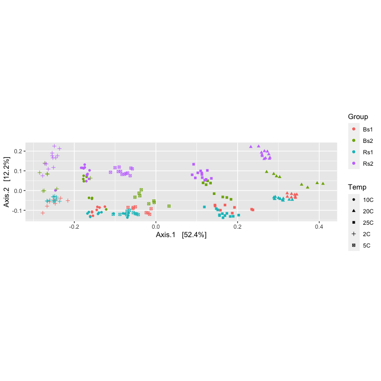
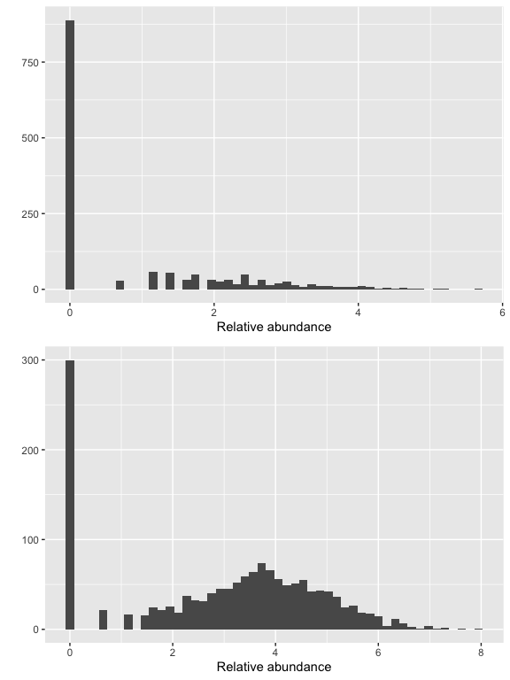
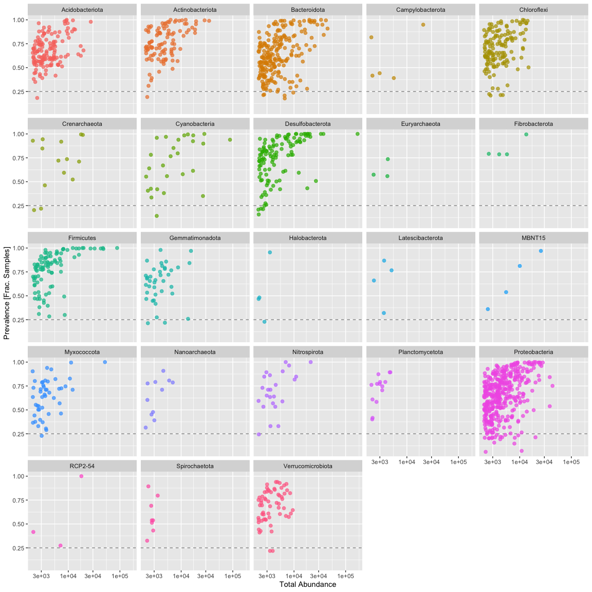

# Filtering taxa and samples

## Load our libraries


```r
# Set up global options for nice reports and keeping figures:
knitr::opts_chunk$set(fig.width=14, fig.height=8, fig.align="center",
                      warning=FALSE, message=FALSE)
```

Lets start by loading libraries


```r
library(phyloseq)
library(phangorn)
library(ggplot2)
library(gridExtra)

nice_colors = c("#999999", "#E69F00", "#56B4E9","#e98756","#c08160","#5800e6", "#CDDC49", "#C475D3", 
                "#E94B30", "#233F57", "#FEE659", "#A1CFDD", "#F4755E", "#D6F6F7","#EB6D58", "#6898BF")
```

## Load prior results


```r
load(file=file.path("rdata_objects", "initial_rooted.Rdata"))
```


## Now lets filter out samples (outliers and low performing samples)

Some simple ordination looking for 'outlier' samples, first we variance stabilize the data with a log transform, the perform MDS using bray's distances


```r
logt  = transform_sample_counts(ps, function(x) log(1 + x) )
out.mds.logt <- ordinate(logt, method = "MDS", distance = "bray")
evals <- out.mds.logt$values$Eigenvalues
plot_ordination(logt, out.mds.logt, type = "samples",
                color = "Group", shape = "Temp") + labs(col = "Group") +
                coord_fixed(sqrt(evals[2] / evals[1]))
```



Show taxa proportions per sample (quickplot)

```r
grid.arrange(nrow = 2,
qplot(as(otu_table(logt),"matrix")[which.min(sample_sums(logt)),], geom = "histogram", bins=50) +
  xlab("Relative abundance"),

qplot(as(otu_table(logt),"matrix")[which.max(sample_sums(logt)),], geom = "histogram", bins=50) +
  xlab("Relative abundance")
)
```



Nothing so far seems to stand out and our read counts ASV look good from our prior QA, so we won't remove any samples in this experiment.

However if we wanted to prune samples, say removing all <10K reads, the code below would do so.

```r
ps.pruned <- prune_samples(sample_sums(ps)>=10000, ps)
ps.pruned
```

```
## phyloseq-class experiment-level object
## otu_table()   OTU Table:         [ 1500 taxa and 195 samples ]
## sample_data() Sample Data:       [ 195 samples by 4 sample variables ]
## tax_table()   Taxonomy Table:    [ 1500 taxa by 7 taxonomic ranks ]
## phy_tree()    Phylogenetic Tree: [ 1500 tips and 1499 internal nodes ]
## refseq()      DNAStringSet:      [ 1500 reference sequences ]
```

* *So how many samples were pruned?*

## Taxa Filtering

## Whole phylum filtering

Now lets investigate low prevelance/abundance phylum and subset them out.

Lets generate a prevelance table (number of samples each taxa occurs in) for each taxa.

```r
prevalenceDF = data.frame(Prevalence = colSums(otu_table(ps) > 0 ),
                          TotalAbundance = colSums(otu_table(ps)),
                          tax_table(ps)
                          )

idxAbundance = order(prevalenceDF$TotalAbundance, decreasing=T)
idxPrevalence = order(prevalenceDF$Prevalence, decreasing=T)
```


```r
summary_prevalence <- plyr::ddply(prevalenceDF, "Phylum", function(df1){
  data.frame(mean_prevalence=mean(df1$Prevalence),totalAbundance=sum(df1$TotalAbundance,na.rm = T),stringsAsFactors = F)
})
summary_prevalence[order(summary_prevalence$totalAbundance, decreasing = FALSE),]
```

```
##                          Phylum mean_prevalence totalAbundance
## 10                 Dependentiae        114.0000           2071
## 12              Elusimicrobiota        146.0000           2239
## 31                 Zixibacteria        131.0000           2610
## 28 SAR324 clade(Marine group B)        132.0000           2703
## 16               Fusobacteriota         59.0000           5677
## 24              Patescibacteria         92.0000           6053
## 9               Deferrisomatota        148.5000           6170
## 3                Armatimonadota        119.6667           8416
## 18                Halobacterota        105.0000          10292
## 13                Euryarchaeota        122.6667          10738
## 19             Latescibacterota        128.7500          14570
## 29                Spirochaetota        116.3750          21799
## 14               Fibrobacterota        165.5000          25583
## 27                      RCP2-54        111.0000          27067
## 5              Campylobacterota        118.8000          33503
## 22                Nanoarchaeota        125.7273          39722
## 25              Planctomycetota        140.8571          42482
## 20                       MBNT15        132.0000          43641
## 7                 Crenarchaeota        137.7857         113557
## 23                 Nitrospirota        137.0417         125623
## 17              Gemmatimonadota        125.9231         178671
## 21                  Myxococcota        125.6809         244296
## 30            Verrucomicrobiota        136.2459         247497
## 8                 Cyanobacteria        137.6667         331544
## 2              Actinobacteriota        150.0388         629465
## 6                   Chloroflexi        138.4236         684725
## 1               Acidobacteriota        133.2391         692709
## 15                   Firmicutes        153.3011         720766
## 11             Desulfobacterota        147.0940         938085
## 4                  Bacteroidota        123.6171        1459098
## 26               Proteobacteria        129.4045        2409594
```

Using the table above, determine the phyla to filter, filtering 0.1% experiment wide abundance.

```r
sum(summary_prevalence$totalAbundance)*0.001
```

```
## [1] 9080.966
```

```r
table(summary_prevalence$totalAbundance/sum(summary_prevalence$totalAbundance) >= 0.001)
```

```
## 
## FALSE  TRUE 
##     8    23
```

```r
keepPhyla <- summary_prevalence$Phylum[summary_prevalence$totalAbundance/sum(summary_prevalence$totalAbundance) >= 0.001]

ps.1 = subset_taxa(ps, Phylum %in% keepPhyla)
ps.1
```

```
## phyloseq-class experiment-level object
## otu_table()   OTU Table:         [ 1487 taxa and 197 samples ]
## sample_data() Sample Data:       [ 197 samples by 4 sample variables ]
## tax_table()   Taxonomy Table:    [ 1487 taxa by 7 taxonomic ranks ]
## phy_tree()    Phylogenetic Tree: [ 1487 tips and 1486 internal nodes ]
## refseq()      DNAStringSet:      [ 1487 reference sequences ]
```

```r
summary_prevalence <- summary_prevalence[summary_prevalence$Phylum %in% keepPhyla,]
summary_prevalence[order(summary_prevalence$totalAbundance, decreasing = FALSE),]
```

```
##               Phylum mean_prevalence totalAbundance
## 18     Halobacterota        105.0000          10292
## 13     Euryarchaeota        122.6667          10738
## 19  Latescibacterota        128.7500          14570
## 29     Spirochaetota        116.3750          21799
## 14    Fibrobacterota        165.5000          25583
## 27           RCP2-54        111.0000          27067
## 5   Campylobacterota        118.8000          33503
## 22     Nanoarchaeota        125.7273          39722
## 25   Planctomycetota        140.8571          42482
## 20            MBNT15        132.0000          43641
## 7      Crenarchaeota        137.7857         113557
## 23      Nitrospirota        137.0417         125623
## 17   Gemmatimonadota        125.9231         178671
## 21       Myxococcota        125.6809         244296
## 30 Verrucomicrobiota        136.2459         247497
## 8      Cyanobacteria        137.6667         331544
## 2   Actinobacteriota        150.0388         629465
## 6        Chloroflexi        138.4236         684725
## 1    Acidobacteriota        133.2391         692709
## 15        Firmicutes        153.3011         720766
## 11  Desulfobacterota        147.0940         938085
## 4       Bacteroidota        123.6171        1459098
## 26    Proteobacteria        129.4045        2409594
```

### Individual Taxa Filtering

Subset to the remaining phyla by prevelance.

```r
prevalenceDF1 = subset(prevalenceDF, Phylum %in% get_taxa_unique(ps.1, taxonomic.rank = "Phylum"))

ggplot(prevalenceDF1, aes(TotalAbundance,Prevalence / nsamples(ps.1),color=Phylum)) +
  # Include a guess for filtering intercept
  geom_hline(yintercept = 0.25, alpha = 0.5, linetype = 2) + geom_point(size = 2, alpha = 0.7) +
  scale_x_log10() +  xlab("Total Abundance") + ylab("Prevalence [Frac. Samples]") +
  facet_wrap(~Phylum) + theme(legend.position="none")
```


Sometimes you see a clear break, however we aren't seeing one here. In this case I'm mostly interested in those organisms consistently present in the dataset, so I'm removing all taxa present in less than 25% of samples.


```r
#  Define prevalence threshold as 10% of total samples ~ set of replicates
prevalenceThreshold = 0.25 * nsamples(ps.1)
prevalenceThreshold
```

```
## [1] 49.25
```

```r
# Execute prevalence filter, using `prune_taxa()` function
keepTaxa = rownames(prevalenceDF1)[(prevalenceDF1$Prevalence >= prevalenceThreshold)]
length(keepTaxa)
```

```
## [1] 1441
```

```r
ps.1 = prune_taxa(keepTaxa, ps.1)
ps.1
```

```
## phyloseq-class experiment-level object
## otu_table()   OTU Table:         [ 1441 taxa and 197 samples ]
## sample_data() Sample Data:       [ 197 samples by 4 sample variables ]
## tax_table()   Taxonomy Table:    [ 1441 taxa by 7 taxonomic ranks ]
## phy_tree()    Phylogenetic Tree: [ 1441 tips and 1440 internal nodes ]
## refseq()      DNAStringSet:      [ 1441 reference sequences ]
```

Agglomerate taxa at the Genus level (combine all with the same name) removing all asv without genus level assignment.


```r
length(get_taxa_unique(ps.1, taxonomic.rank = "Family"))
```

```
## [1] 172
```

```r
ps.1 = tax_glom(ps.1, "Family", NArm = TRUE)
ps.1 = tax_glom(ps.1, "Genus", NArm = FALSE)
ps.1
```

```
## phyloseq-class experiment-level object
## otu_table()   OTU Table:         [ 171 taxa and 197 samples ]
## sample_data() Sample Data:       [ 197 samples by 4 sample variables ]
## tax_table()   Taxonomy Table:    [ 171 taxa by 7 taxonomic ranks ]
## phy_tree()    Phylogenetic Tree: [ 171 tips and 170 internal nodes ]
## refseq()      DNAStringSet:      [ 171 reference sequences ]
```

```r
## out of curiosity how many "reads" does this leave us at???
sum(colSums(otu_table(ps.1)))
```

```
## [1] 7377131
```

* *So what percentage is that? from the original dataset?*

# Cleanup

Save object


```r
dir.create("rdata_objects", showWarnings = FALSE)
save(list=c("ps","ps.1"), file=file.path("rdata_objects", "filtered_phyloseq.RData"))
```

Get next Rmd


```r
download.file("https://raw.githubusercontent.com/ucdavis-bioinformatics-training/2021-May-Microbial-Community-Analysis/master/data_analysis/mca_part4.Rmd", "mca_part4.Rmd")
```

Record session information


```r
sessionInfo()
```

```
## R version 4.0.3 (2020-10-10)
## Platform: x86_64-apple-darwin17.0 (64-bit)
## Running under: macOS Big Sur 10.16
## 
## Matrix products: default
## BLAS:   /Library/Frameworks/R.framework/Versions/4.0/Resources/lib/libRblas.dylib
## LAPACK: /Library/Frameworks/R.framework/Versions/4.0/Resources/lib/libRlapack.dylib
## 
## locale:
## [1] en_US.UTF-8/en_US.UTF-8/en_US.UTF-8/C/en_US.UTF-8/en_US.UTF-8
## 
## attached base packages:
## [1] stats     graphics  grDevices utils     datasets  methods   base     
## 
## other attached packages:
## [1] gridExtra_2.3   ggplot2_3.3.3   phangorn_2.7.0  ape_5.5        
## [5] phyloseq_1.34.0
## 
## loaded via a namespace (and not attached):
##  [1] Biobase_2.50.0      sass_0.4.0          jsonlite_1.7.2     
##  [4] splines_4.0.3       foreach_1.5.1       bslib_0.2.5.1      
##  [7] assertthat_0.2.1    highr_0.9           stats4_4.0.3       
## [10] yaml_2.2.1          progress_1.2.2      pillar_1.6.1       
## [13] lattice_0.20-44     glue_1.4.2          quadprog_1.5-8     
## [16] digest_0.6.27       XVector_0.30.0      colorspace_2.0-1   
## [19] htmltools_0.5.1.1   Matrix_1.3-3        plyr_1.8.6         
## [22] pkgconfig_2.0.3     zlibbioc_1.36.0     purrr_0.3.4        
## [25] scales_1.1.1        tibble_3.1.2        mgcv_1.8-35        
## [28] generics_0.1.0      farver_2.1.0        IRanges_2.24.1     
## [31] ellipsis_0.3.2      withr_2.4.2         BiocGenerics_0.36.1
## [34] survival_3.2-11     magrittr_2.0.1      crayon_1.4.1       
## [37] evaluate_0.14       fansi_0.4.2         nlme_3.1-152       
## [40] MASS_7.3-54         vegan_2.5-7         tools_4.0.3        
## [43] data.table_1.14.0   prettyunits_1.1.1   hms_1.1.0          
## [46] lifecycle_1.0.0     stringr_1.4.0       Rhdf5lib_1.12.1    
## [49] S4Vectors_0.28.1    munsell_0.5.0       cluster_2.1.2      
## [52] Biostrings_2.58.0   ade4_1.7-16         compiler_4.0.3     
## [55] jquerylib_0.1.4     rlang_0.4.11        rhdf5_2.34.0       
## [58] grid_4.0.3          iterators_1.0.13    rhdf5filters_1.2.1 
## [61] biomformat_1.18.0   igraph_1.2.6        labeling_0.4.2     
## [64] rmarkdown_2.8       gtable_0.3.0        codetools_0.2-18   
## [67] multtest_2.46.0     DBI_1.1.1           reshape2_1.4.4     
## [70] R6_2.5.0            knitr_1.33          dplyr_1.0.6        
## [73] utf8_1.2.1          fastmatch_1.1-0     permute_0.9-5      
## [76] stringi_1.6.2       parallel_4.0.3      Rcpp_1.0.6         
## [79] vctrs_0.3.8         tidyselect_1.1.1    xfun_0.23
```
