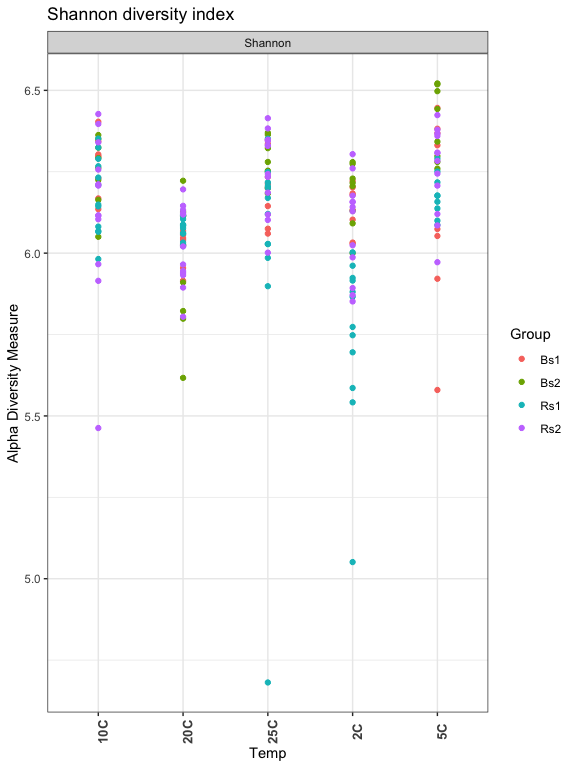
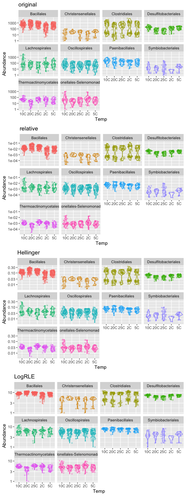

# Diversity andTransformations

## Load our libraries


```r
# Set up global options for nice reports and keeping figures:
knitr::opts_chunk$set(fig.width=14, fig.height=8, fig.align="center",
                      warning=FALSE, message=FALSE)
```

Lets start by loading libraries


```r
library(phyloseq)
library(phangorn)
library(vegan)
library(ggplot2)
library(edgeR)
library(gridExtra)

nice_colors = c("#999999", "#E69F00", "#56B4E9","#e98756","#c08160","#5800e6", "#CDDC49", "#C475D3", 
                "#E94B30", "#233F57", "#FEE659", "#A1CFDD", "#F4755E", "#D6F6F7","#EB6D58", "#6898BF")
```

## Load prior results


```r
load(file=file.path("rdata_objects", "filtered_phyloseq.RData"))
ls()
```

```
## [1] "nice_colors" "ps"          "ps.1"
```

#### Diversity Plots
These plots are generated on untrimmed datasets as indicated:

>     You must use untrimmed datasets for meaningful
>     results, as these estimates (and even the ``observed'' richness)
>     are highly dependent on the number of singletons. You can always
>     trim the data later on if needed, just not before using this
>     function.

* [Rarefaction, Alpha Diversity, and Statistics](https://www.ncbi.nlm.nih.gov/pmc/articles/PMC6819366/)
* [Estimating the Number of Species in Microbial Diversity Studies](https://www.annualreviews.org/doi/abs/10.1146/annurev-statistics-022513-115654)
* And see [this](http://evolution.unibas.ch/walser/bacteria_community_analysis/2015-02-10_MBM_tutorial_combined.pdf) for a more detailed review of the large variety of diversity measures.
* [Deciphering Diversity Indices for a Better Understanding of Microbial Communities](http://www.jmb.or.kr/submission/Journal/027/JMB027-12-02_FDOC_2.pdf)

Observed Richness: The number of ASVs detected per sample:


```r
plot_richness(ps, x="Temp", measures=c("Observed"), color="Group") + theme_bw() +
  theme(axis.text.x = element_text(angle = 90, face = "bold", size=10)) + 
  ggtitle("Observed diversity")
```


Shannon Diversity: Measures richness and evenness


```r
#c("Observed", "Chao1", "ACE", "Shannon",  "Simpson", "InvSimpson", "Fisher")
plot_richness(ps, x="Temp", measures=c("Shannon"), color="Group") + theme_bw() +
  theme(axis.text.x = element_text(angle = 90, face = "bold", size=10)) + 
  ggtitle("Shannon diversity index")
```



Chao1 index: Attempts to estimate true richness based on Poisson distribution


* *What are the other measure?*
* *Explore the other measures*


```r
er <- estimate_richness(ps, measures=c("Chao1", "Shannon"))

res.aov <- aov(er$Shannon ~ Group + Temp, data = as(sample_data(ps),"data.frame"))
# Summary of the analysis
summary(res.aov)
```

```
##              Df Sum Sq Mean Sq F value   Pr(>F)    
## Group         3  0.891  0.2972   7.586 8.11e-05 ***
## Temp          4  1.693  0.4233  10.806 6.56e-08 ***
## Residuals   189  7.404  0.0392                     
## ---
## Signif. codes:  0 '***' 0.001 '**' 0.01 '*' 0.05 '.' 0.1 ' ' 1
```

These measures can then be modelled and tested for differences between your groups.

## Investigate transformations. 

We transform microbiome count data to account for differences in library size, variance, scale, etc.

* RLE -  is the scaling factor method proposed by Anders and Huber (2010). We call it “relative log expression”, as median library is calculated from the geometric mean of all columns and the median ratio of each sample to the median library is taken as the scale factor.


```r
## for Firmictures
plot_abundance = function(physeq, meta, title = "", Facet = "Order", Color = "Order"){
  # Arbitrary subset, based on Phylum, for plotting
  p1f = subset_taxa(physeq, Phylum %in% c("Firmicutes"))
  mphyseq = psmelt(p1f)
  mphyseq <- subset(mphyseq, Abundance > 0)
  ggplot(data = mphyseq, mapping = aes_string(x = meta,y = "Abundance",
                                 color = Color, fill = Color)) +
    geom_violin(fill = NA) +
    geom_point(size = 1, alpha = 0.3,
                position = position_jitter(width = 0.3)) +
    facet_wrap(facets = Facet) + scale_y_log10() +
    theme(legend.position="none") + labs(title=title)
}

# transform counts into "relative abundances"
ps.1ra = transform_sample_counts(ps.1, function(x){x / sum(x)})

# transform counts into "hellinger standardized counts"
ps.1hell <- ps.1
otu_table(ps.1hell) <- otu_table(decostand(otu_table(ps.1hell), method = "hellinger"), taxa_are_rows=FALSE)

# RLE counts
ps.1RLE <- ps.1
RLE_normalization <- function(phyloseq){
  prior.count = 1
  count_scale = median(sample_sums(phyloseq))
  m = as(otu_table(phyloseq), "matrix")
  d = DGEList(counts=t(m), remove.zeros = FALSE)
  z = calcNormFactors(d, method="RLE")
  y <- as.matrix(z)
  lib.size <- z$samples$lib.size * z$samples$norm.factors
  ## rescale to median sample count
  out <- round(count_scale * sweep(y,MARGIN=2, STATS=lib.size,FUN = "/"))
  dimnames(out) <- dimnames(y)
  t(out)
}
otu_table(ps.1RLE) <- otu_table(RLE_normalization(ps.1), taxa_are_rows=FALSE)
ps.1logRLE = transform_sample_counts(ps.1RLE, function(x){ log2(x +1)})

plotOriginal = plot_abundance(ps.1, "Temp", title="original")
plotRelative = plot_abundance(ps.1ra, "Temp", title="relative")
plotHellinger = plot_abundance(ps.1hell, "Temp", title="Hellinger")
plotLogRLE = plot_abundance(ps.1logRLE, "Temp", title="LogRLE")

# Combine each plot into one graphic.
grid.arrange(nrow = 4, plotOriginal, plotRelative, plotHellinger, plotLogRLE)
```



[Normalization and microbial differential abundance strategies depend upon data characteristics](https://microbiomejournal.biomedcentral.com/articles/10.1186/s40168-017-0237-y)

# Cleanup

Save object


```r
dir.create("rdata_objects", showWarnings = FALSE)
save(list=c("ps","ps.1","ps.1ra", "ps.1hell", "ps.1logRLE"), file=file.path("rdata_objects", "transformed_objects.RData"))
```

Get next Rmd


```r
download.file("https://raw.githubusercontent.com/ucdavis-bioinformatics-training/2021-May-Microbial-Community-Analysis/master/data_analysis/mca_part5.Rmd", "mca_part5.Rmd")
```

Record session information


```r
sessionInfo()
```

```
## R version 4.0.3 (2020-10-10)
## Platform: x86_64-apple-darwin17.0 (64-bit)
## Running under: macOS Big Sur 10.16
## 
## Matrix products: default
## BLAS:   /Library/Frameworks/R.framework/Versions/4.0/Resources/lib/libRblas.dylib
## LAPACK: /Library/Frameworks/R.framework/Versions/4.0/Resources/lib/libRlapack.dylib
## 
## locale:
## [1] en_US.UTF-8/en_US.UTF-8/en_US.UTF-8/C/en_US.UTF-8/en_US.UTF-8
## 
## attached base packages:
## [1] stats     graphics  grDevices utils     datasets  methods   base     
## 
## other attached packages:
##  [1] gridExtra_2.3   edgeR_3.32.1    limma_3.46.0    ggplot2_3.3.3  
##  [5] vegan_2.5-7     lattice_0.20-44 permute_0.9-5   phangorn_2.7.0 
##  [9] ape_5.5         phyloseq_1.34.0
## 
## loaded via a namespace (and not attached):
##  [1] Biobase_2.50.0      sass_0.4.0          jsonlite_1.7.2     
##  [4] splines_4.0.3       foreach_1.5.1       bslib_0.2.5.1      
##  [7] assertthat_0.2.1    highr_0.9           stats4_4.0.3       
## [10] yaml_2.2.1          progress_1.2.2      pillar_1.6.1       
## [13] glue_1.4.2          quadprog_1.5-8      digest_0.6.27      
## [16] XVector_0.30.0      colorspace_2.0-1    htmltools_0.5.1.1  
## [19] Matrix_1.3-3        plyr_1.8.6          pkgconfig_2.0.3    
## [22] zlibbioc_1.36.0     purrr_0.3.4         scales_1.1.1       
## [25] tibble_3.1.2        mgcv_1.8-35         farver_2.1.0       
## [28] generics_0.1.0      IRanges_2.24.1      ellipsis_0.3.2     
## [31] withr_2.4.2         BiocGenerics_0.36.1 survival_3.2-11    
## [34] magrittr_2.0.1      crayon_1.4.1        evaluate_0.14      
## [37] fansi_0.4.2         nlme_3.1-152        MASS_7.3-54        
## [40] tools_4.0.3         data.table_1.14.0   prettyunits_1.1.1  
## [43] hms_1.1.0           lifecycle_1.0.0     stringr_1.4.0      
## [46] Rhdf5lib_1.12.1     S4Vectors_0.28.1    munsell_0.5.0      
## [49] locfit_1.5-9.4      cluster_2.1.2       Biostrings_2.58.0  
## [52] ade4_1.7-16         compiler_4.0.3      jquerylib_0.1.4    
## [55] rlang_0.4.11        rhdf5_2.34.0        grid_4.0.3         
## [58] iterators_1.0.13    rhdf5filters_1.2.1  biomformat_1.18.0  
## [61] igraph_1.2.6        labeling_0.4.2      rmarkdown_2.8      
## [64] gtable_0.3.0        codetools_0.2-18    multtest_2.46.0    
## [67] DBI_1.1.1           reshape2_1.4.4      R6_2.5.0           
## [70] knitr_1.33          dplyr_1.0.6         utf8_1.2.1         
## [73] fastmatch_1.1-0     stringi_1.6.2       parallel_4.0.3     
## [76] Rcpp_1.0.6          vctrs_0.3.8         tidyselect_1.1.1   
## [79] xfun_0.23
```
