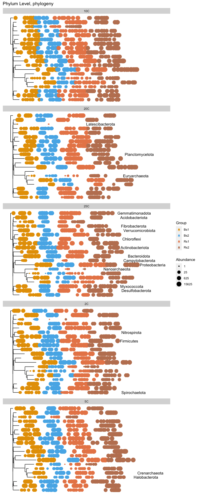
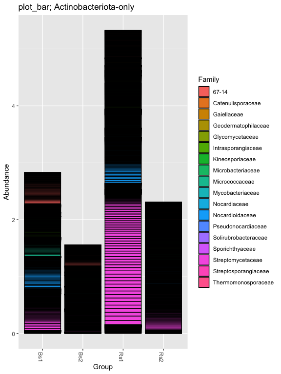
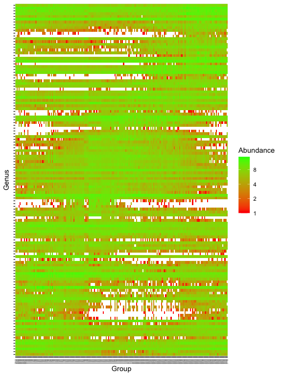

# Some Graphical Summaries

## Load our libraries


```r
# Set up global options for nice reports and keeping figures:
knitr::opts_chunk$set(fig.width=14, fig.height=8, fig.align="center",
                      warning=FALSE, message=FALSE)
```

Lets start by loading libraries


```r
library(phyloseq)
library(phangorn)
library(ggplot2)

nice_colors = c("#999999", "#E69F00", "#56B4E9","#e98756","#c08160","#5800e6", "#CDDC49", "#C475D3", 
                "#E94B30", "#233F57", "#FEE659", "#A1CFDD", "#F4755E", "#D6F6F7","#EB6D58", "#6898BF")
```

## Load prior results


```r
load(file=file.path("rdata_objects", "transformed_objects.RData"))
```

## Plotting a Phylogenetic Tree

```r
ps.class = tax_glom(ps.1, "Phylum")
plot_tree(ps.class, label.tips="Phylum", color="Group", size='abundance') + scale_color_manual(values=nice_colors[-1]) +
           ggtitle("Phylum Level, phylogeny") + facet_wrap(.~Temp, ncol=1)
```




```r
# Subset dataset by phylum
ps.1ra_acidob = subset_taxa(ps.1ra, Phylum=="Actinobacteriota")
plot_bar(ps.1ra_acidob, "Group", "Abundance", "Family", title= "plot_bar; Actinobacteriota-only")
```




```r
prop  = transform_sample_counts(ps.1, function(x) x / sum(x) )
keepTaxa <- ((apply(otu_table(prop) >= 0.005,2,sum,na.rm=TRUE) > 2) | (apply(otu_table(prop) >= 0.05, 2, sum,na.rm=TRUE) > 0))
table(keepTaxa)
```

```
## keepTaxa
## FALSE  TRUE 
##    45   126
```

```r
ps.1logRLE_trim <- prune_taxa(keepTaxa,ps.1logRLE)

plot_heatmap(ps.1logRLE_trim, "PCoA", distance="bray", sample.label="Group", taxa.label="Genus", low="red", high="green", na.value="white")
```




# Cleanup

Get next Rmd


```r
download.file("https://raw.githubusercontent.com/ucdavis-bioinformatics-training/2021-May-Microbial-Community-Analysis/master/data_analysis/mca_part6.Rmd", "mca_part6.Rmd")
```

Record session information


```r
sessionInfo()
```

```
## R version 4.0.3 (2020-10-10)
## Platform: x86_64-apple-darwin17.0 (64-bit)
## Running under: macOS Big Sur 10.16
## 
## Matrix products: default
## BLAS:   /Library/Frameworks/R.framework/Versions/4.0/Resources/lib/libRblas.dylib
## LAPACK: /Library/Frameworks/R.framework/Versions/4.0/Resources/lib/libRlapack.dylib
## 
## locale:
## [1] en_US.UTF-8/en_US.UTF-8/en_US.UTF-8/C/en_US.UTF-8/en_US.UTF-8
## 
## attached base packages:
## [1] stats     graphics  grDevices utils     datasets  methods   base     
## 
## other attached packages:
## [1] ggplot2_3.3.3   phangorn_2.7.0  ape_5.5         phyloseq_1.34.0
## 
## loaded via a namespace (and not attached):
##  [1] Rcpp_1.0.6          lattice_0.20-44     prettyunits_1.1.1  
##  [4] Biostrings_2.58.0   assertthat_0.2.1    digest_0.6.27      
##  [7] foreach_1.5.1       utf8_1.2.1          R6_2.5.0           
## [10] plyr_1.8.6          stats4_4.0.3        evaluate_0.14      
## [13] highr_0.9           pillar_1.6.1        zlibbioc_1.36.0    
## [16] rlang_0.4.11        progress_1.2.2      data.table_1.14.0  
## [19] vegan_2.5-7         jquerylib_0.1.4     S4Vectors_0.28.1   
## [22] Matrix_1.3-3        rmarkdown_2.8       labeling_0.4.2     
## [25] splines_4.0.3       stringr_1.4.0       igraph_1.2.6       
## [28] munsell_0.5.0       compiler_4.0.3      xfun_0.23          
## [31] pkgconfig_2.0.3     BiocGenerics_0.36.1 multtest_2.46.0    
## [34] mgcv_1.8-35         htmltools_0.5.1.1   biomformat_1.18.0  
## [37] tidyselect_1.1.1    tibble_3.1.2        quadprog_1.5-8     
## [40] IRanges_2.24.1      codetools_0.2-18    permute_0.9-5      
## [43] fansi_0.4.2         withr_2.4.2         crayon_1.4.1       
## [46] dplyr_1.0.6         MASS_7.3-54         rhdf5filters_1.2.1 
## [49] grid_4.0.3          nlme_3.1-152        jsonlite_1.7.2     
## [52] gtable_0.3.0        lifecycle_1.0.0     DBI_1.1.1          
## [55] magrittr_2.0.1      scales_1.1.1        stringi_1.6.2      
## [58] farver_2.1.0        XVector_0.30.0      reshape2_1.4.4     
## [61] bslib_0.2.5.1       ellipsis_0.3.2      vctrs_0.3.8        
## [64] generics_0.1.0      fastmatch_1.1-0     Rhdf5lib_1.12.1    
## [67] iterators_1.0.13    tools_4.0.3         ade4_1.7-16        
## [70] Biobase_2.50.0      glue_1.4.2          purrr_0.3.4        
## [73] hms_1.1.0           parallel_4.0.3      survival_3.2-11    
## [76] yaml_2.2.1          colorspace_2.0-1    rhdf5_2.34.0       
## [79] cluster_2.1.2       knitr_1.33          sass_0.4.0
```
