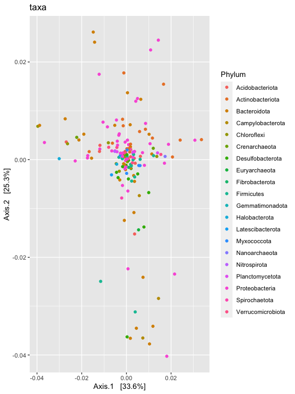
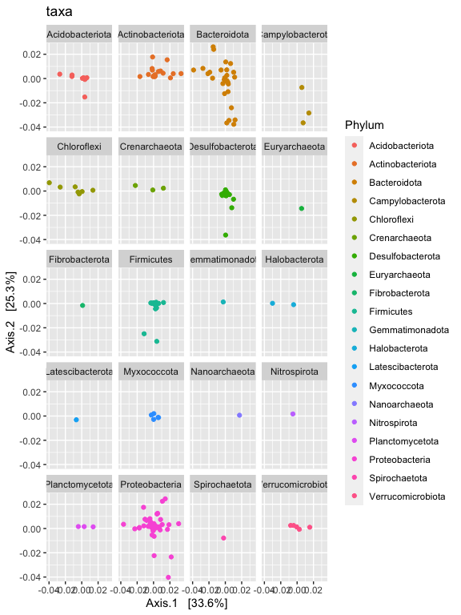
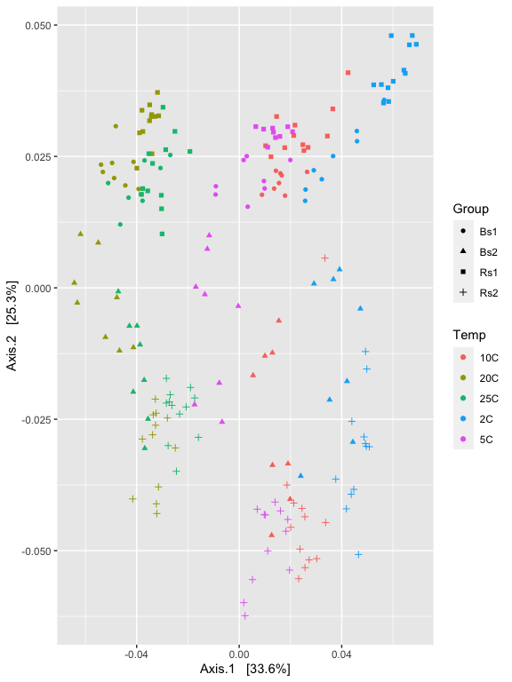
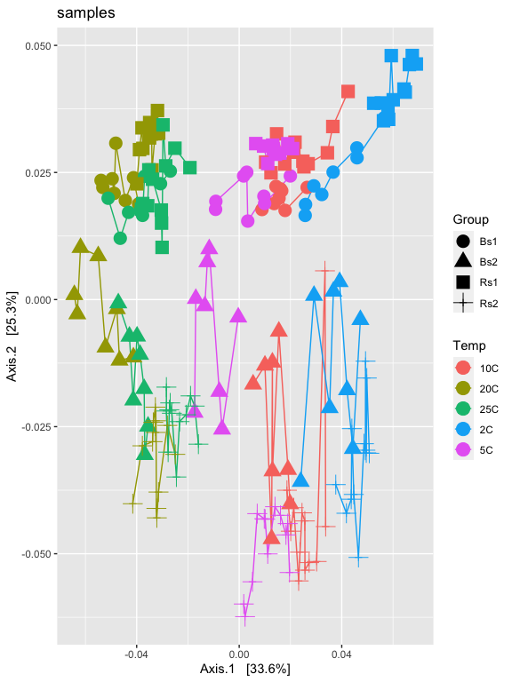
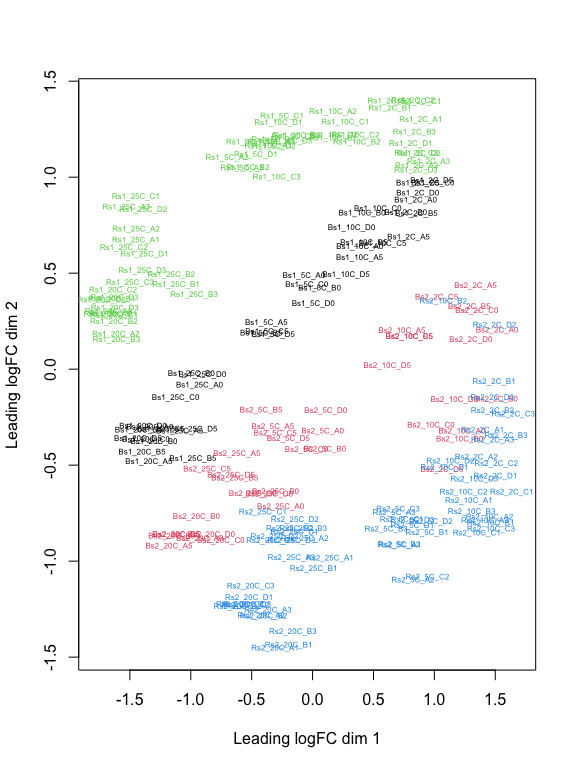
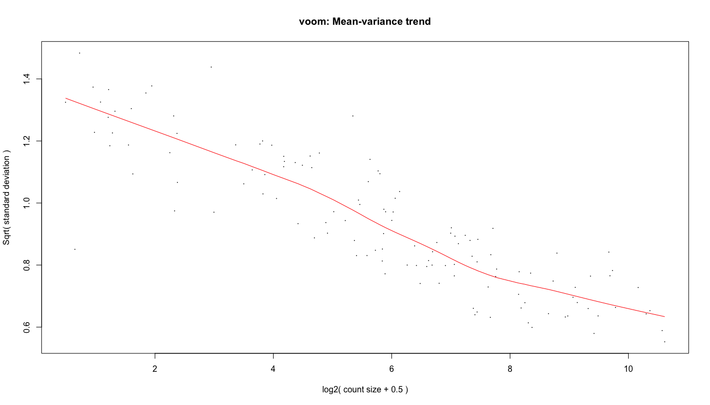

# Differential Abundance and Ordination

## Load our libraries


```r
# Set up global options for nice reports and keeping figures:
knitr::opts_chunk$set(fig.width=14, fig.height=8, fig.align="center",
                      warning=FALSE, message=FALSE)
```

Lets start by loading libraries


```r
library(phyloseq)
library(phangorn)
library(ggplot2)
library(edgeR)

nice_colors = c("#999999", "#E69F00", "#56B4E9","#e98756","#c08160","#5800e6", "#CDDC49", "#C475D3", 
                "#E94B30", "#233F57", "#FEE659", "#A1CFDD", "#F4755E", "#D6F6F7","#EB6D58", "#6898BF")
```

## Load prior results


```r
load(file=file.path("rdata_objects", "transformed_objects.RData"))
```

## Ordination


```r
#Can view the distance method options with
?distanceMethodList

# can veiw the oridinate methods with
?ordinate
```


```r
v1.RLE.ord <- ordinate(ps.1logRLE, "MDS", "wunifrac")

p1 = plot_ordination(ps.1logRLE, v1.RLE.ord, type="taxa", color="Phylum", title="taxa")
p1
```



```r
p1 + facet_wrap(~Phylum, 5)
```



```r
p2 = plot_ordination(ps.1logRLE, v1.RLE.ord, type="samples", color="Temp", shape="Group")
p2
```



```r
p2 + geom_line() + geom_point(size=5) + ggtitle("samples")
```



```r
p2
```


```r
p3 = plot_ordination(ps.1logRLE, v1.RLE.ord, type="biplot", color="Temp", shape="Group") +
                     scale_shape_manual(values=1:7)
```

Now try doing oridination with other transformations, such as relative abundance, log. Also looks and see if you can find any trends in the variable Dist_from_edge.


## Differential Abundances

For differential abundances we can use RNAseq pipeline EdgeR and limma voom.


```r
m = as(otu_table(ps.1), "matrix")
# Define gene annotations (`genes`) as tax_table
taxonomy = tax_table(ps.1, errorIfNULL=FALSE)
if( !is.null(taxonomy) ){
  taxonomy = data.frame(as(taxonomy, "matrix"))
}
# Now turn into a DGEList
d = DGEList(counts=t(m), genes=taxonomy, remove.zeros = TRUE)

## reapply filter
prop  = transform_sample_counts(ps.1, function(x) x / sum(x) )
keepTaxa <- ((apply(otu_table(prop) >= 0.005,2,sum,na.rm=TRUE) > 2) | (apply(otu_table(prop) >= 0.05, 2, sum,na.rm=TRUE) > 0))
table(keepTaxa)
```

```
## keepTaxa
## FALSE  TRUE 
##    45   126
```

```r
d <- d[keepTaxa,]


# Calculate the normalization factors
z = calcNormFactors(d, method="RLE")
# Check for division by zero inside `calcNormFactors`
if( !all(is.finite(z$samples$norm.factors)) ){
  stop("Something wrong with edgeR::calcNormFactors on this data,
       non-finite $norm.factors, consider changing `method` argument")
}

plotMDS(z, col = as.numeric(factor(sample_data(ps.1)$Group)), labels = sample_names(ps.1), cex=0.5)
```




```r
# Create a model based on Group and Temp
mm <- model.matrix( ~ Group + Temp, data=data.frame(as(sample_data(ps.1),"matrix"))) # specify model with no intercept for easier contrasts
y <- voom(d, mm, plot = T)
```



```r
fit <- lmFit(y, mm)
head(coef(fit))
```

```
##      (Intercept)   GroupBs2   GroupRs1   GroupRs2    Temp20C    Temp25C
## ASV1    15.35742  0.1256581 -0.5698628  0.6392527 -0.8229097 -1.0553334
## ASV3    14.61709 -0.7136901  0.1052358  0.2534002  1.1955619  0.2930345
## ASV6    13.31930  0.6085330  1.3441854  2.0221380 -0.6051854 -0.5160887
## ASV7    16.09468 -1.2648445  0.4935341 -1.6233779 -1.1027966 -0.6994907
## ASV8    13.71681 -0.3855912  2.5926603  1.1961396 -1.0519939 -0.3542017
## ASV9    12.96485 -0.5507289  0.5174640  0.5880462  1.4988344  1.0806996
##          Temp2C        Temp5C
## ASV1  0.5272901  0.2073291883
## ASV3 -1.2345773 -0.4207734660
## ASV6  0.2173731 -0.4876642016
## ASV7  0.1893725 -0.3187794246
## ASV8  0.4979659 -0.4388517236
## ASV9 -0.4580184 -0.0008135052
```

```r
# single contrast comparing Temp 5 - 20
contr <- makeContrasts(GroupBs2 = "GroupBs2",
                       levels = colnames(coef(fit)))
tmp <- contrasts.fit(fit, contr)
tmp <- eBayes(tmp)
tmp2 <- topTable(tmp, coef=1, sort.by = "P", n = Inf)
tmp2$Taxa <- rownames(tmp2)
tmp2 <- tmp2[,c("Taxa","logFC","AveExpr","P.Value","adj.P.Val")]
length(which(tmp2$adj.P.Val < 0.05)) # number of Differentially abundant taxa
```

```
## [1] 86
```

```r
sigtab = cbind(as(tmp2, "data.frame"), as(tax_table(ps.1)[rownames(tmp2), ], "matrix"))
head(sigtab)
```

```
##          Taxa     logFC  AveExpr      P.Value    adj.P.Val  Kingdom
## ASV249 ASV249  1.699798 12.19842 2.004571e-42 2.525759e-40 Bacteria
## ASV33   ASV33 -1.501967 14.30675 2.204571e-38 1.388880e-36 Bacteria
## ASV84   ASV84  1.556297 12.96270 2.525979e-33 1.060911e-31 Bacteria
## ASV32   ASV32  1.337056 14.60051 4.617744e-30 1.225911e-28 Bacteria
## ASV7     ASV7 -1.264845 15.11903 4.864726e-30 1.225911e-28 Bacteria
## ASV841 ASV841  2.299733 10.68649 1.326902e-24 2.786494e-23 Bacteria
##                Phylum               Class            Order
## ASV249   Bacteroidota         Bacteroidia    Bacteroidales
## ASV33  Proteobacteria Alphaproteobacteria Sphingomonadales
## ASV84    Bacteroidota           Kryptonia     Kryptoniales
## ASV32    Bacteroidota         Bacteroidia    Bacteroidales
## ASV7     Bacteroidota         Bacteroidia  Chitinophagales
## ASV841  Spirochaetota        Spirochaetia   Spirochaetales
##                         Family Genus Species
## ASV249                    SB-5  <NA>    <NA>
## ASV33        Sphingomonadaceae  <NA>    <NA>
## ASV84                    BSV26  <NA>    <NA>
## ASV32  Bacteroidetes vadinHA17  <NA>    <NA>
## ASV7          Chitinophagaceae  <NA>    <NA>
## ASV841         Spirochaetaceae  <NA>    <NA>
```


# Cleanup

Save object


```r
dir.create("rdata_objects", showWarnings = FALSE)
save(ps, file=file.path("rdata_objects", "final.Rdata"))
```

Record session information


```r
sessionInfo()
```

```
## R version 4.0.3 (2020-10-10)
## Platform: x86_64-apple-darwin17.0 (64-bit)
## Running under: macOS Big Sur 10.16
## 
## Matrix products: default
## BLAS:   /Library/Frameworks/R.framework/Versions/4.0/Resources/lib/libRblas.dylib
## LAPACK: /Library/Frameworks/R.framework/Versions/4.0/Resources/lib/libRlapack.dylib
## 
## locale:
## [1] en_US.UTF-8/en_US.UTF-8/en_US.UTF-8/C/en_US.UTF-8/en_US.UTF-8
## 
## attached base packages:
## [1] stats     graphics  grDevices utils     datasets  methods   base     
## 
## other attached packages:
## [1] edgeR_3.32.1    limma_3.46.0    ggplot2_3.3.3   phangorn_2.7.0 
## [5] ape_5.5         phyloseq_1.34.0
## 
## loaded via a namespace (and not attached):
##  [1] Biobase_2.50.0      sass_0.4.0          jsonlite_1.7.2     
##  [4] splines_4.0.3       foreach_1.5.1       bslib_0.2.5.1      
##  [7] assertthat_0.2.1    highr_0.9           stats4_4.0.3       
## [10] yaml_2.2.1          progress_1.2.2      pillar_1.6.1       
## [13] lattice_0.20-44     glue_1.4.2          quadprog_1.5-8     
## [16] digest_0.6.27       XVector_0.30.0      colorspace_2.0-1   
## [19] htmltools_0.5.1.1   Matrix_1.3-3        plyr_1.8.6         
## [22] pkgconfig_2.0.3     zlibbioc_1.36.0     purrr_0.3.4        
## [25] scales_1.1.1        tibble_3.1.2        mgcv_1.8-35        
## [28] farver_2.1.0        generics_0.1.0      IRanges_2.24.1     
## [31] ellipsis_0.3.2      withr_2.4.2         BiocGenerics_0.36.1
## [34] survival_3.2-11     magrittr_2.0.1      crayon_1.4.1       
## [37] evaluate_0.14       fansi_0.4.2         nlme_3.1-152       
## [40] MASS_7.3-54         vegan_2.5-7         tools_4.0.3        
## [43] data.table_1.14.0   prettyunits_1.1.1   hms_1.1.0          
## [46] lifecycle_1.0.0     stringr_1.4.0       Rhdf5lib_1.12.1    
## [49] S4Vectors_0.28.1    munsell_0.5.0       locfit_1.5-9.4     
## [52] cluster_2.1.2       Biostrings_2.58.0   ade4_1.7-16        
## [55] compiler_4.0.3      jquerylib_0.1.4     rlang_0.4.11       
## [58] rhdf5_2.34.0        grid_4.0.3          iterators_1.0.13   
## [61] rhdf5filters_1.2.1  biomformat_1.18.0   igraph_1.2.6       
## [64] labeling_0.4.2      rmarkdown_2.8       gtable_0.3.0       
## [67] codetools_0.2-18    multtest_2.46.0     DBI_1.1.1          
## [70] reshape2_1.4.4      R6_2.5.0            knitr_1.33         
## [73] dplyr_1.0.6         utf8_1.2.1          fastmatch_1.1-0    
## [76] permute_0.9-5       stringi_1.6.2       parallel_4.0.3     
## [79] Rcpp_1.0.6          vctrs_0.3.8         tidyselect_1.1.1   
## [82] xfun_0.23
```
