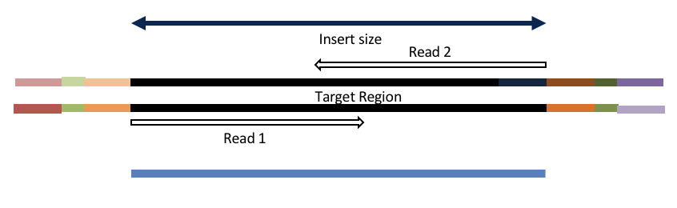

# Sequence Preprocessing

This document assumes [project_setup](./00-project_setup.md) has been completed.

```bash
cd /share/workshop/mca_workshop/$USER/
```

## Why Preprocess Reads

We have found that aggressively “cleaning” and preprocessing of reads can make a large difference to the speed and quality of mapping and assembly results. Preprocessing your reads means:

  * Removing bases of unwanted sequence (Ex. vectors, adapter, primer sequence, polyA tails).
  * Merge/join short overlapping paired-end reads.
  * Remove low quality bases or N characters.
  * Remove reads originating from PCR duplication.
  * Remove reads that are not of primary interest (contamination).
  * Remove too short reads.

Preprocessing also produces a number of statistics about the samples. These can be used to evaluate sample-to-sample consistency.

### Preprocessing Statistics as QA/QC.

Beyond generating "better" data for downstream analysis, preprocessing statistics also give you an idea as to the original quality and complexity of the sample, library generation features, and sequencing quality.

This can help inform you of how you might change your procedures in the future, either sample preparation, or in library preparation.

We’ve found it best to perform __QA/QC__ on both the run as a whole (poor samples can negatively affect other samples) and on the samples themselves as they compare to other samples (**BE CONSISTENT**).

Reports such as Basespace for Illumina, are great ways to evaluate the run as a whole, the sequencing provider usually does this for you.  

Visualizing the preprocessing summary are a great way to look for technical bias across your experiment. Poor quality samples often appear as outliers and can ethically be removed due to identified technical issues. You should **NOT** see a trend associated with any experimental factors. That scenario should raise concerns about technical sample processing bias.

**Many technical things happen between original sample and data, preprocessing is working backwards through that process to get as close as we can to original sample**


### Amplicon Preprocessing Workflow

1. Raw data stats.
1. Overlapping paired end reads and remove any adapters (overhangs).
1. Identify and remove primer sequences.
1. Remove reads containing 'N' bases.
1. Filter any reads that are less then, or greater than, some length parameter.
1. Preprocessed stats

## HTStream Streamed Preprocessing of Sequence Data

HTStream is a suite of preprocessing applications for high throughput sequencing data (ex. Illumina). A fast C++ implementation, designed with discreet functionality that can be pipelined together using standard Unix piping.

Benefits Include:
  * No intermediate files, reducing storage footprint.
  * Reduced I/O, files are only read in and written out once to disk.
  * Handles both single end and paired end reads at the same time.
  * Applications process reads at the same time allowing for process parallelization.
  * Built on top of mature C++ Boost libraries to reduce bugs and memory leaks.
  * Designed following the philosophy of [Program Design in the UNIX Environment](https://onlinelibrary.wiley.com/doi/abs/10.1002/j.1538-7305.1984.tb00055.x).
  * Works with native Unix/Linux applications such as grep/sed/awk etc.
  * Can build a custom preprocessing pipeline to fit the specific expectation of the data.
  * A single JSON output per sample detailing the preprocessing statistics from each application.

HTStream achieves these benefits by using a tab delimited intermediate format that allows for streaming from application to application. This streaming creates some awesome efficiencies when preprocessing HTS data and makes it fully interoperable with other standard Linux tools.

### HTStream applications

HTStream includes the following applications:

hts_AdapterTrimmer: Identify and remove adapter sequences.  
hts_CutTrim: Discreet 5' and/or 3' basepair trimming.  
hts_LengthFilter: Remove reads outside of min and/or max length.  
hts_NTrimmer: Extract the longest subsequence with no Ns.    
hts_Overlapper: Overlap paired end reads, removing adapters when present.  
hts_PolyATTrim: Identify and remove polyA/T sequence.  
hts_Primers: Identify and optionally remove 5' and/or 3' primer sequence.  
hts_QWindowTrim: 5' and/or 3' quality score base trimming using windows.  
hts_SeqScreener: Identify and remove/keep/count contaminants (default phiX).  
hts_Stats: Compute read stats.  
hts_SuperDeduper: Identify and remove PCR duplicates.  

The source code and pre-compiled binaries for Linux can be downloaded and installed [from the GitHub repository](https://github.com/s4hts/HTStream).

HTStream is also avaiable on [Bioconda](https://bioconda.github.io/), and there is even an image on [Docker Hub](https://hub.docker.com/r/dzs74/htstream).

HTStream was designed to be extensible. We continue to add new preprocessing routines and welcome contributions from collaborators.

If you encounter any bugs or have suggestions for improvement, please post them to [issues](https://github.com/s4hts/HTStream/issues).

# HTStream Setup for our Project

## Example, running HTStream

Let's run the first step of our HTStream preprocessing pipeline, which is always to gather basic stats on the read files. For now, we're only going to run one sample through the pipeline.

When building a new pipeline, it is almost always a good idea to use a small subset of the data in order to speed up development. A small sample of reads will take seconds to process and help you identify problems that may have only been apparent after hours of waiting for the full data set to process.

1. Let's start by first taking a small subsample of reads, so that our trial run through the pipeline goes really quickly.

    ```bash
    cd /share/workshop/mca_workshop/$USER/
    mkdir HTS_testing
    cd HTS_testing
    pwd
    ```

    * *Why run ```pwd``` here?*

    Then create a small dataset.

    ```bash
    zcat ../00-RawData/Bs1_2C_A0_R1.fastq.gz | head -400000 | gzip > Bs1_2C_A0.subset_R1.fastq.gz
    zcat ../00-RawData/Bs1_2C_A0_R2.fastq.gz | head -400000 | gzip > Bs1_2C_A0.subset_R2.fastq.gz
    ls
    ```

    So we ```zcat``` (uncompress and send to stdout), pipe ```|```  to ```head``` (param -400000) then pipe to ```gzip``` to recompress and name our files subset.

    * *How many reads are we going to analyze in our subset?*

1. Now we'll run our first preprocessing step ```hts_Stats```, we are going to use the version of HTStream installed in '/share/workshop/mca_htstream/bin/'.

    ```bash
    cd /share/workshop/mca_workshop/$USER//HTS_testing
    export PATH=/share/workshop/mca_htstream/bin/:$PATH
    hts_Stats --help
    ```

    * *What version of hts_Stats is loaded?*


1. Now lets run ```hts_Stats``` and look at the output.

    ```bash
    hts_Stats -1 Bs1_2C_A0.subset_R1.fastq.gz \
              -2 Bs1_2C_A0.subset_R2.fastq.gz \
              -L Bs1_2C_A0.stats.json > out.tab
    ```

    * *What happens if you run hts_Stats without piping output to out.tab?*

    * *Can you think of a way to view the output from hts_Stats in less without creating out.tab?*

    By default, all HTS apps output tab formatted files to the stdout.

    Take a look at the output (remember ```q``` quits):
    ```bash
    less out.tab
    ```

    The output was difficult to understand, lets try without line wrapping (note that you can also type ```-S``` from within ```less``` if you forget). Scroll with the arrow keys, left, right, up, and down.
    ```bash
    less -S out.tab
    ```

    And delete out.tab since we are done with it:
    ```bash
    rm out.tab
    ```

    Remember how this output looks, we will revisit it later.

1. Now lets change the command slightly.
    ```bash
    hts_Stats -1 Bs1_2C_A0.subset_R1.fastq.gz \
              -2 Bs1_2C_A0.subset_R2.fastq.gz \
              -L Bs1_2C_A0.stats.json -f Bs1_2C_A0.stats
    ```

    * *What parameters did we use, what do they do?*

    Lets take a look at the output of stats

    ```bash
    ls -lah
    ```

    <div class="output">msettles@tadpole:/share/workshop/mca_workshop/msettles/chipseq_example/HTS_testing$     ls -lah
    total 67M
    drwxrwsr-x 2 msettles workshop    7 May 17 05:50 .
    drwxrwsr-x 6 msettles workshop    7 May 17 05:43 ..
    -rw-rw-r-- 1 msettles workshop 143K May 17 05:50 Bs1_2C_A0.stats.json
    -rw-rw-r-- 1 msettles workshop  17M May 17 05:50 Bs1_2C_A0.stats_R1.fastq.gz
    -rw-rw-r-- 1 msettles workshop  22M May 17 05:50 Bs1_2C_A0.stats_R2.fastq.gz
    -rw-rw-r-- 1 msettles workshop  17M May 17 05:47 Bs1_2C_A0.subset_R1.fastq.gz
    -rw-rw-r-- 1 msettles workshop  22M May 17 05:47 Bs1_2C_A0.subset_R2.fastq.gz
    </div>

    * *Which files were generated from hts\_Stats?*

1. Lets look at the file Bs1_2C_A0.stats\.json*

    ```bash
    cat Bs1_2C_A0.stats.json
    ```

    The logs generated by htstream are in [JSON](https://en.wikipedia.org/wiki/JSON) format, like a database format but meant to be readable.


## Next lets screen out PhiX, the Illumina control

1. First, view the help documentation for hts_SeqScreener

    ```bash
    cd /share/workshop/mca_workshop/$USER//HTS_testing
    hts_SeqScreener -h
    ```

    * *What parameters are needed to:
        1. provide a reference to hts_SeqScreener and
        2. count, and not screen occurrences?*

1. Run HTStream on the small test set.

    ```bash
    hts_SeqScreener -1 Bs1_2C_A0.subset_R1.fastq.gz \
                    -2 Bs1_2C_A0.subset_R2.fastq.gz \
                    -r -L Bs1_2C_A0.phix.json -f Bs1_2C_A0.phix
    ```

    * *Which files were generated from hts\_SeqScreener?*

    * *Lets look at the file Bs1_2C_A0.phix.json?*

    * *What do you notice about the Bs1_2C_A0.phix.json?*

    * *How many reads were identified as phix?*

### Stream multiple applications together.

The power of HTStream is the ability to stream reads through multiple programs using pipes. By streaming reads through programs, processing will be much quicker because each read is read in only once and written out only once. This approach also uses significantly less storage as there are no intermediate files. HTStream can do this by streaming a tab-delimited format called tab6.

Single end reads are 3 columns:

`read1id  read1seq  read1qual`

Paired end reads are 6 columns:

`read1id  read1seq  read1qual  read2id  read2seq  read2qual`

1. So lets first run hts_Stats and then hts_SeqScreener in a streamed fashion.

    ```bash
    cd /share/workshop/mca_workshop/$USER//HTS_testing

    hts_Stats -1 Bs1_2C_A0.subset_R1.fastq.gz \
              -2 Bs1_2C_A0.subset_R2.fastq.gz \
              -L Bs1_2C_A0.streamed.json |
    hts_SeqScreener -A Bs1_2C_A0.streamed.json \
              -f Bs1_2C_A0.streamed
    ```

    Note the pipe, ```|```, between the two applications!

    **Questions**
    * *What new parameters did we use here?*

    * *What parameter is SeqScreener using that specifies how reads are input?*

    * *Lets look at the file Bs1_2C_A0.streamed.json?*


    ```bash
    zless -S Bs1_2C_A0.streamed.json
    ```

## A MCA preprocessing pipeline

1. hts_Stats: get stats on *input* raw reads
1. hts_Overlapper: overlap, identify and remove adapter sequence
1. hts_Primers: Identify and remove primer sequences
1. hts_NTrimmer: trim to remove any remaining N characters
1. hts_LengthFilter: use to remove all reads < 50bp
1. hts_Stats: get stats on *output* cleaned reads

### Adapter trimming by overlapping reads.

Consider the three scenarios below

**Insert size > length of the number of cycles**


hts_AdapterTrimmer product: original pairs

hts_Overlapper product: original pairs

**Insert size < length of the number of cycles (10bp min)**



hts_AdapterTrimmer product: original pairs

hts_Overlapper product: extended, single

**Insert size < length of the read length**


hts_AdapterTrimmer product: adapter trimmed, pairs

hts_Overlapper product: adapter trimmed, single

Both hts_AdapterTrimmer and hts_Overlapper employ this principle to identify and remove adapters for paired-end reads. For paired-end reads the difference between the two are the output, as overlapper produces single-end reads when the pairs overlap and adapter trimmer keeps the paired end format. For single-end reads, adapter trimmer identifies and removes adapters by looking for the adapter sequence, where overlapper just ignores single-end reads (nothing to overlap).

### Primer identification and removal

Primers are **not** part of the sample genome, are artifical, and should therefor be removed. Further, looking for and identifying the primers on both the 5' and 3' ends validates the read was indeed produced by PCR (i.e. its not contaminant, or PhiX). hts_Primers, compares the beginning (primer region) of each read to all possible primers given and returns the best match < specified maximimum *Levenshtein* distance (mismatches, insertion, deletions) + final n basepair exact match.

The final exact matches are used to produce a hard cut between the primer and the interior sequences (a hard edge).

Further, hts_Primers allows for the detection of phase-shifted primers and the flip.


### Now lets see if we can find evidence of Illumina sequencing adapters in our subset.
Remember that Illumina reads must have P5 and P7 adapters and generally look like this (in R1 orientation):

P5---Read1primer---INSERT---IndexReadprimer--index--P7(rc)

This sequence is P7(rc): ATCTCGTATGCCGTCTTCTGCTTG. It should be at the end of any R1 that contains a full-length adapter sequence.

```bash
cd /share/workshop/mca_workshop/$USER//HTS_testing
zcat Bs1_2C_A0.subset_R1.fastq.gz | grep TCTCGTATGCCGTCTTCTGCTTG
```

* *What did you find?*
* *Do you remember how to count the number of instances?*
* *Roughly, what percentage of this data has adapters?*


### Lets put it all together

```bash
cd /share/workshop/mca_workshop/$USER//HTS_testing

hts_Stats \
    --stats-file Bs1_2C_A0.preprocessed.json \
    -1 Bs1_2C_A0.subset_R1.fastq.gz \
    -2 Bs1_2C_A0.subset_R2.fastq.gz \
    --notes 'Initial Stats' | \
hts_Overlapper \
    --append-stats-file Bs1_2C_A0.preprocessed.json \
    --number-of-threads 4 \
    --notes 'Overlap reads' | \
hts_Primers \
    --append-stats-file Bs1_2C_A0.preprocessed.json \
    --primers_5p GTGYCAGCMGCCGCGGTAA \
    --primers_3p GGACTACNVGGGTWTCTAAT \
    --min_primer_matches 2 \
    --flip \
    --float 5 \
    --notes 'Single set V3V4 primers' | \
hts_NTrimmer \
    --append-stats-file Bs1_2C_A0.preprocessed.json \
    --exclude \
    --notes 'Remove any reads with Ns' | \
hts_LengthFilter \
    --append-stats-file Bs1_2C_A0.preprocessed.json \
    --min-length 100 \
    --max-length 400 \
    --notes 'Filter sequences 100 - 400' | \
hts_Stats \
    --append-stats-file Bs1_2C_A0.preprocessed.json \
    --force \
    --fastq-output Bs1_2C_A0.preprocessed \
    --notes 'Final Stats'
```

**Adapters?**

```bash
cd /share/workshop/mca_workshop/$USER//HTS_testing
zcat Bs1_2C_A0.preprocessed_R1.fastq.gz | grep TCTCGTATGCCGTCTTCTGCTTG
```

Note the patterns:
* In the first routine we use -1 and -2 to specify the original reads.
* In the final routine -f fastq prefix to write out new preprocessed reads.
* For the log, we specify -L in the first app to write out to a new log, and then use -A for the second routine onward to append log output, generating a single log file at the end.
* All other parameters are algorithm specific, can review using --help

**Questions**
* *Review the final json output, how many reads do we have left?*

* *Confirm that number by counting the number of reads in the final output files.*

* *How many adapters did we detect, cut off?*

* *How many reads were did we identify with Primers?*

* *Anything else interesting?*

## Run HTStream on the MCA Project.

We can now run the preprocessing routine across all samples on the real data using a SLURM script, [hts_preproc.slurm](../../software_scripts/scripts/hts_preproc.slurm), that we should take a look at now.

```bash
cd /share/workshop/mca_workshop/$USER/  # We'll run this from the main directory
wget https://raw.githubusercontent.com/ucdavis-bioinformatics-training/2021-May-Microbial-Community-Analysis/master/software_scripts/scripts/hts_preproc.slurm -O hts_preproc.slurm
less hts_preproc.slurm
```

When you are done, type "q" to exit.

<pre class="prettyprint"><code class="language-sh" style="background-color:333333">#!/bin/bash

#SBATCH --job-name=r16S_amplicon # Job name
#SBATCH --nodes=1
#SBATCH --ntasks=4
#SBATCH --time=120
#SBATCH --mem=3000 # Memory pool for all cores (see also --mem-per-cpu)
#SBATCH --partition=production
#SBATCH --account=workshop
#SBATCH --reservation=workshop
#SBATCH --array=1-8
#SBATCH --output=slurm_out/r16S_amplicon_%A_%a.out # File to which STDOUT will be written
#SBATCH --error=slurm_out/r16S_amplicon_%A_%a.err # File to which STDERR will be written
#SBATCH --mail-type=ALL
#SBATCH --mail-user=youremail@address.com

start=`date +%s`
echo $HOSTNAME
echo "My SLURM_ARRAY_TASK_ID: " $SLURM_ARRAY_TASK_ID


export PATH="/share/workshop/mca_htstream/bin/:$PATH"

sample=`sed "${SLURM_ARRAY_TASK_ID}q;d" samples.txt`

inpath='00-RawData'
outpath='01-HTS_Preproc'
[[ -d ${outpath} ]] || mkdir -p ${outpath}

echo "SAMPLE: ${sample}"

call=" \
    hts_Stats \
        --stats-file ${outpath}/${sample}.json \
        -1 ${inpath}/${sample}*_R1.fastq.gz \
        -2 ${inpath}/${sample}*_R2.fastq.gz \
        --notes 'Initial Stats' | \
    hts_Overlapper \
        --append-stats-file ${outpath}/${sample}.json \
        --number-of-threads 4 \
        --notes 'Overlap reads' | \
    hts_Primers \
        --append-stats-file ${outpath}/${sample}.json \
        --primers_5p GTGYCAGCMGCCGCGGTAA \
        --primers_3p GGACTACNVGGGTWTCTAAT \
        --min_primer_matches 2 \
        --flip \
        --float 5 \
        --notes 'Single set V3V4 primers' | \
    hts_NTrimmer \
        --append-stats-file ${outpath}/${sample}.json \
        --exclude \
        --notes 'Remove any reads with Ns' | \
    hts_LengthFilter \
        --append-stats-file ${outpath}/${sample}.json \
        --min-length 100 \
        --max-length 400 \
        --notes 'Filter sequences 100 - 400' | \
    hts_Stats \
        --append-stats-file ${outpath}/${sample}.json \
        --force \
        --fastq-output ${outpath}/${sample} \
        --notes 'Final Stats'"
echo $call
eval $call

end=`date +%s`

runtime=$((end-start))

echo $runtime
</code></pre>

Double check to make sure that slurm_out and 01-HTS_Preproc directories have been created for output, then after looking at the script, let's run it.

```bash
cd /share/workshop/mca_workshop/$USER/
mkdir -p slurm_out  # -p tells mkdir not to complain if the directory already exists
mkdir -p 01-HTS_Preproc
sbatch hts_preproc.slurm  # moment of truth!
```

We can watch the progress of our task array using the 'squeue' command. Takes a couple minutes to process each sample.

```bash
squeue -u $USER  # use your username
```

## Quality Assurance - Preprocessing statistics as QA/QC.

Beyond generating "better" data for downstream analysis, cleaning statistics also give you an idea as to the original quality and complexity of the sample, library generation, and sequencing quality.

This can help inform you of how you might change your protocol/procedures in the future, either sample preparation, or in library preparation.

I’ve found it best to perform QA/QC on both the run as a whole (poor samples can affect other samples) and on the samples themselves as they compare to other samples **(BE CONSISTENT!)**.

Reports such as Basespace for Illumina, are great ways to evaluate the run as a whole, the sequencing provider usually does this for you. Plots of the preprocessing summary are a great way to look for technical bias across your experiment. Poor quality samples often appear as outliers and can ethically be removed due to identified technical issues.

1. Let's make sure that all jobs completed successfully.

    Lets first check all the "htstream_%\*.out" and "htstream_%\*.err" files:

    ```bash
    cd /share/workshop/mca_workshop/$USER/
    cat slurm_out/r16S_amplicon_*.out
    ```

    Look through the output and make sure you don't see any errors. Now do the same for the err files:

    ```bash
    cat slurm_out/r16S_amplicon_*.err
    ```

    Also, check the output files. First check the number of forward and reverse output files (should be 8 each):

    ```bash
    cd 01-HTS_Preproc
    ls *R1* | wc -l
    ls *R2* | wc -l
    ```

    Check the sizes of the files as well. Make sure there are no zero or near-zero size files and also make sure that the size of the files are in the same ballpark as each other:

    ```bash
    ls -lh *
    ```

    **IF** for some reason it didn't finish, is corrupted or you missed the session, please let one of us know and we will help, and you can copy over a completed copy

    ```bash
    #cp -r /share/workshop/mca_workshop/msettles/HTS_testing /share/workshop/mca_workshop/$USER/.
    #cp -r /share/workshop/mca_workshop/msettles/01-HTS_Preproc /share/workshop/mca_workshop/$USER/.
    ```

1. Let's take a look at the differences in adapter content between the input and output files. First look at the input file:

    ```bash
    cd /share/workshop/mca_workshop/$USER/
    zless 00-RawData/Bs1_2C_A0_R1.fastq.gz
    ```

    Let's search for the adapter sequence. Type '/' (a forward slash), and then type **AGATCGGAAGAGCACACGTCTGAACTCCAGTCAC** (the first part of the forward adapter). Press Enter. This will search for the sequence in the file and highlight each time it is found. You can now type "n" to cycle through the places where it is found. When you are done, type "q" to exit. Alternatively, you can use zcat and grep like we did earlier.

    Now look at the output file:

    ```bash
    zless 01-HTS_Preproc/Bs1_2C_A0_R1.fastq.gz
    ```

    If you scroll through the data (using the spacebar), you will see that some of the sequences have been trimmed. Now, try searching for **AGATCGGAAGAGCACACGTCTGAACTCCAGTCAC** again. You shouldn't find it (adapters were trimmed remember), but rarely is anything perfect. You may need to use Control-C to get out of the search and then "q" to exit the 'less' screen.

    Lets grep for the sequence and count occurrences

    ```bash
    zcat  00-RawData/Bs1_2C_A0_R1.fastq.gz | grep  AGATCGGAAGAGCACACGTCTGAACTCCAGTCAC | wc -l
    zcat  01-HTS_Preproc/Bs1_2C_A0_R1.fastq.gz | grep  AGATCGGAAGAGCACACGTCTGAACTCCAGTCAC | wc -l
    ```

    * *What is the reduction in adapters found?*

1. MultiQC QA/QC Summary of the json files.

Finally lets use [MultiQC](https://multiqc.info/) to generate a summary of our output. Currently MultiQC support for HTStream is in development by Bradley Jenner, and has not been included in the official MultiQC package. If you'd like to try it on your own data, you can find a copy here [https://github.com/s4hts/MultiQC](https://github.com/s4hts/MultiQC).

```bash
## Run multiqc to collect statistics and create a report:
cd /share/workshop/mca_workshop/$USER/
module load multiqc/htstream.dev0
multiqc -i mca-cleaning -o mca-htstream-report ./01-HTS_Preproc
```

Transfer mca-cleaning_multiqc_report.html to your computer and open it in a web browser.

Or in case of emergency, download this copy: [mca-cleaning_multiqc_report.html](mca-cleaning_multiqc_report.html)

**Questions**
* *Any problematic samples?*

* *Anything else worth discussing?*
