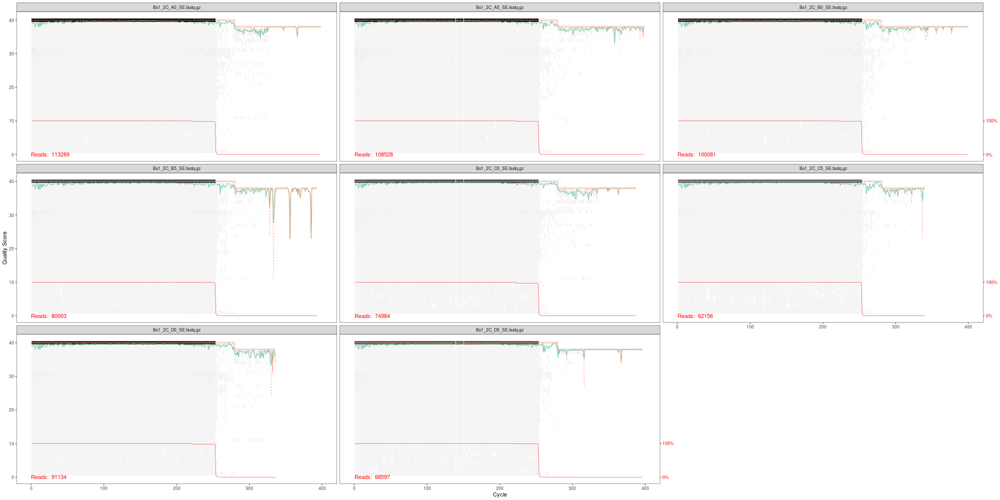
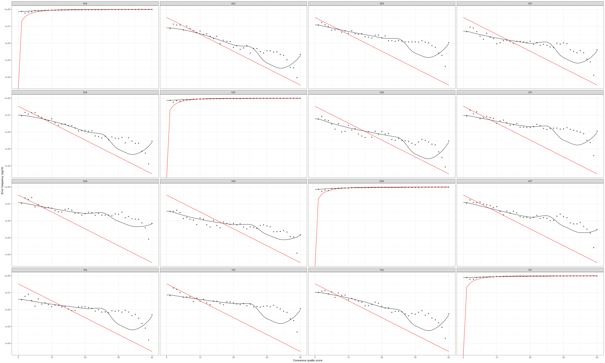

# Preprocessed reads to phyloseq object using dada2

Some of you should also launch an interactive session on the cluster before performing the below opperation.

```
srun -t 12:00:00 -c 8 -n 1 --mem 48000 --partition production --account workshop --reservation workshop --pty /bin/bash
```

```
cd /share/workshop/mca_workshop/$USER
mkdir 03-DADA2
module load R
R
```

**From here on out the commands will be within R**

## R Environment Setup

We are going to use a R package library directory for this workshop that is located inside the workshop folder. All packages have already been installed a few days ago.


### R Library

Lets make sure we are in the rigth location and our library path is available.

    getwd()
    .libPaths("/share/workshop/mca_htstream/r_lib")
    .libPaths()


### Packages being used for this section

    ## CODE to install the needed packages
    # if (!requireNamespace("BiocManager", quietly = TRUE))
    #     install.packages("BiocManager")
    # BiocManager::install(c("dada2", "phyloseq"))
    # BiocManager::install(c("DECIPHER", "phangorn"))
    ##

    library(dada2); packageVersion("dada2")


# Data reduction with DADA2

In this section we want to process our sequence data, summarizing it to:

1.  Abundance table
2.  Taxanomic assignment  
3.  Phylogenetic tree  


The typical means for producing abundance tables are

1. OTU clustering by 3% simularity.
2. Direct classification of each read to tax, summarize by taxa assignment
3. Production of amplicon sequence variants (ASV)

Both methods 1 and 2 are outdated and ASV analysis is appropriate approach.


## Sample file setup.

First task is to get the sample files we will be processing. If you recall htstream produced both SE and PE files, but our SE files are the ones we want to use here.

    path <- "01-HTS_Preproc"
    list.files(path)

### Get a list of "SE" files names

We can get a list of all SE files in the HTStream directory by using the pattern '_SE/fastq'

    fnSEs = sort(list.files(path, pattern="*_SE.fastq", full.names=T))
    sample.names <-  sapply(strsplit(basename(fnSEs), "_SE"), `[`, 1)


* *How many samples are there, is that the correct number*

### Creating a metadata object from the read IDs

In this case our sample names are sufficient to produce our metadata. *Usually* you would have a metadata table, excel-like table, with the mapping of sample names to information about that sample.

    split_names <- strsplit(sample.names,split="_")
    grp <- sapply(split_names, "[[",1L)
    temp <- sapply(split_names,"[[",2L)
    replicate <- sapply(split_names,"[[",3L)

    mdata <- data.frame("SampleID"=sample.names, "Group"=grp, "Temp"=temp, "Replicate"=replicate)

* *How many groups do we have here?*
* *How many temps? how many replicate ids?*

### Produce and examine raw data quality profile plots:

    png(file.path("03-DADA2","fnSEs_quality.png"), width=2000, height=1000)
    plotQualityProfile(fnSEs)
    dev.off()




* *Does this look similar to the plot in our htstream multiqc?*

***Note:*** Any additional filtering or trimming should no longer be necessary if reads are preprocessed with htsteam *and* filtered for any reads containing an "N".

## DADA2 Denoising

We get right to denoising of our SE reads. DADA2 first generates an error model based on \~100 million basepair (default), the algorithm uses the first n reads across N samples that sum to 100M. The error model is to estimate a specific error-signature of the run. If your dataset spans multiple runs, this process should be ran for each run separately.

**This can take a little bit, good time for a break**


    derep <- derepFastq(fnSEs)
    errU <- learnErrors(derep, multithread=TRUE, nreads=50000)


We can plot the error profiles and investigate.


    png(file.path("03-DADA2","errors-profiles.png"), width=2500, height=1500)
    plotErrors(errU, nominalQ=TRUE)
    dev.off()




The goal is to have the solid line follow the 'dots' well, after reviewing many experiements you'll be able to tell what sort of deviation is ok. Here we could use more fine tuning.


* *Which parameters of `learnErrors` could be modified to investigate improvement.*
* *On your own, after the workshop, explore these changes and their impact.*


Then DADA2 denoises the dataset using the error model previously generated above. First, dereplicating the sequences, then clustering and aligning, finally denoiseing. It does this by incorporating the consensus quality profiles and abundances of each sequence, and then figures out if each a sequence is more likely to be of biological origin or technical artifact.


This step can be run on individual samples, all samples pooled, or a pseudo-mix of the two pseudo. Running it on individual samples is the least computationally intensive, followed by pseudo and pool. Pooling the samples allow the algorithm to identify a lowly abundant sequence in 1 sample that is more abundant in another. So same low abuntant taxa in some samples could be filtered out when not pooling. For the sake of time we denoise samples individually.


    dadaUs = dada(derep, err=errU, multithread=TRUE)


* *What does this object "dataUs" look like? What is contained within it*

## Generate an ASV count table

Now we aggregate the counts of the denoised sequence data into a sequence table. So the number of reads seen per sample per sequence. Here the columns are denoised sequences and the rows are samples. Save the result for later.


    seqtab <- makeSequenceTable(dadaUs)
    rownames(seqtab) = sample.names

    save(seqtab, file=file.path("03-DADA2","seqtab.RData"))

* *What are the dimensions of our sequence table? How mamy ASVs do we have?*
* *What are the column names?*
* *What are the row names?*
* *Which sequence has the most reads? how many?*
* *Which sequence has the least reads? how many?*


## Chimera removal

Next is to include a chimera removal step. This step takes ASVs with very high read count support and then looks for low read count support ASVs that have perfect matches to two higher-support ASVs over part of their length. So a chimera is a mixture of 2 other ASVs. There is typically a low percentage of these.


    seqtab.nochim <- removeBimeraDenovo(seqtab, method="consensus", multithread=TRUE, verbose=TRUE)


* *What is the new dimensions of our sequence table?*

### Lets explore the object a little.

We now have our final set of denoised data. So what fraction of total reads were retained?

    sum(seqtab.nochim)/sum(seqtab)

Sequence lengths before nochim:


    table(nchar(getSequences(seqtab)))


Look at distribution of fragment lengths discarded by the chimera removal step.


    table(nchar(setdiff(getSequences(seqtab),getSequences(seqtab.nochim))))


Save the result for later.


    save(seqtab.nochim, file=file.path("03-DADA2","seqtab.nochim.RData"))


## Track reads through the pipeline

Lets create a simple table that show us how our ASV table was generated and how many reads per sample we have, and where we lost reads.


    getN <- function(x) sum(getUniques(x))

    track = data.frame(input = sapply(derep, getN),
                       denoised = rowSums(seqtab),
                       nochim = rowSums(seqtab.nochim),
                       ASVs = rowSums(seqtab > 0),
                       ASVs.nochim = rowSums(seqtab.nochim > 0))

    rownames(track) <- sample.names
    track

    write.table(data.frame(sample=rownames(track), track), file=file.path("03-DADA2","read_tracking.tsv"), sep='\t', row.names=F)

* *Which sample "lost" the most/least reads"?*
* *Which sample has the most/least ASVs"?*
* *Do you see a relationship between sequence count and ASV?*

## Assign taxonomy to the sequence data:

DADA2 re-implements the Ribosomal Data Projects Bayesian Classifier. This is a k-mer (15 mers) based algorithm, comparing a subset of each read's kmers to a database (of kmers). 100 bootstraps are performed (randome drawing of kmers) to establish confidence level (bootstrap score) in result. The approach classifies reads to the genus level and supplies a bootstrap score of confidence.

For this you need a database of reference sequences. The developers [supply references](https://benjjneb.github.io/dada2/training.html) for
    * silva
    * rdp
    * Unite
    * GTDB
    * and more ...

For this experiment, we are going to use the [SILVA database](https://zenodo.org/record/4587955#.YKKouZNKgq0)

### Download the SILVA databases for both rdp classifier and species identification.

    dir.create("SILVA")
    download.file("https://zenodo.org/record/4587955/files/silva_nr99_v138.1_train_set.fa.gz?download=1", "SILVA/silva_nr99_v138.1_train_set.fa.gz")
    download.file("https://zenodo.org/record/4587955/files/silva_species_assignment_v138.1.fa.gz?download=1", "SILVA/silva_species_assignment_v138.1.fa.gz")


### Classify agains Silva db

Using `assignTaxonomy` we can assign our seqs to taxa. Here we set the minimum bootstrap score to 0, so we can apply our own bootstrap cutoff, rather than rerunning classification with new bootstrap thresholds.

    taxa.silva.nochim = assignTaxonomy(seqtab.nochim, "SILVA/silva_nr99_v138.1_train_set.fa.gz", multithread = T, minBoot=0, outputBootstraps = TRUE)

The result is a list, first element is the taxanomic assignment, second is the bootstrap scores. Look at the bootstrap scores in the results.

    table(taxa.silva.nochim[[2]][,6] >= 50, useNA ="always")

Then lets choose score of 50, setting to NA anything less than 50.

    taxa.silva.nochim.deboot <- taxa.silva.nochim[[1]]
    taxa.silva.nochim.deboot[taxa.silva.nochim[[2]] < 50] <- NA


### Then perform species assignment

species assignment is done by **exact** sequence match to the database, **AND** the taxomomic path is consistant.


    taxa.silva.nochim.deboot = addSpecies(taxa.silva.nochim.deboot, "SILVA/silva_species_assignment_v138.1.fa.gz")

    save(taxa.silva.nochim.deboot, file=file.path("03-DADA2", "taxa.silva.nochim.RData"))


How many sequences are assigned at each rank?

    colSums(!is.na(taxa.silva.nochim.deboot))


* *Spend a minute exploring this object.*
* *How many 'unique' genera are identifed? species?*
* *Which genera is represented by the most sequences? Do these have different species assignments?*


## Make a phylogenetic tree from all of the ASV sequences

To produce a phylogenetic tree we need to:

* Extract sequences
* Perform multiple sequence alignment
* Convert to phyDat format
* Compute the maximum likelyhood distance matrix
* Compute the neighbor-joining tree
* Compute the likelihood of a tree given a sequence alignment and a model
* update and optimize its parameters.


    library(DECIPHER); packageVersion("DECIPHER")
    library(phangorn); packageVersion("phangorn")

    ASVs.nochim = DNAStringSet(colnames(seqtab.nochim))
    names(ASVs.nochim) = paste0("ASV", 1:ncol(seqtab.nochim))

This can take a while, so we will reduce down to the top 1000 sequences only.

    alignment = AlignSeqs(ASVs.nochim[1:1000], anchor=NA, processors=30)

    phang.align <- phyDat(as(alignment, "matrix"), type="DNA")
    dm <- dist.ml(phang.align)
    treeNJ <- NJ(dm)

    fit = pml(treeNJ, data=phang.align)
    fitGTR <- update(fit, k=4, inv=0.2)
    #fitGTR <- optim.pml(fitGTR, model="GTR", optInv=TRUE, optGamma=TRUE, rearrangement = "stochastic", control = pml.control(trace = 0))


optim.pml *can* take a REALLY long time to run, which is why its commented out here, it essentially optimizes the different model parameters, searching for a better tree using a bunch of stochastic rearrangement strategies.

    save(fitGTR, file=file.path("03-DADA2", "fitGTR.RData"))

* *Explore this object*

## Lets make a Phyloseq object that will then be used for data analysis

The intent of our phyloseq object is to store **ALL** the information for our experiment into a single object. We need:

    * 'otu' table
    * sample metadata
    * taxanomic table
    * sequences
    * phylogenetic tree

### Prepare the different parts of the phyloseq object and Silva annotation

Lets match up the sample metadata, assign names to each sequence ASV 1 through n and genearlly prepare the data.

    mdata2 = mdata[match(rownames(seqtab.nochim), mdata$SampleID), ]
    rownames(mdata2) = mdata2$SampleID

    ASVs.nochim = DNAStringSet(colnames(seqtab.nochim))
    names(ASVs.nochim) = paste0("ASV", 1:ncol(seqtab.nochim))

    tmp.seqtab = seqtab.nochim
    colnames(tmp.seqtab) = names(ASVs.nochim)
    tmp.taxa = taxa.silva.nochim.deboot
    rownames(tmp.taxa) = names(ASVs.nochim)

### Create the object

Load the phyloseq library and create the object.

    library(phyloseq); packageVersion("phyloseq")

    ps.silva.nochim = phyloseq(
                 otu_table(tmp.seqtab, taxa_are_rows=FALSE),
                 sample_data(mdata2),
                 tax_table(tmp.taxa),
                 refseq(ASVs.nochim),
                 phy_tree(fitGTR$tree))

    ps.silva.nochim

### DONE!

    save(ps.silva.nochim, file=file.path("03-DADA2", "phyloseq_nochim_silva.RData"))


Lets copy over the RData file (and any intermediate result you'd like) to your computer for data analysis.
